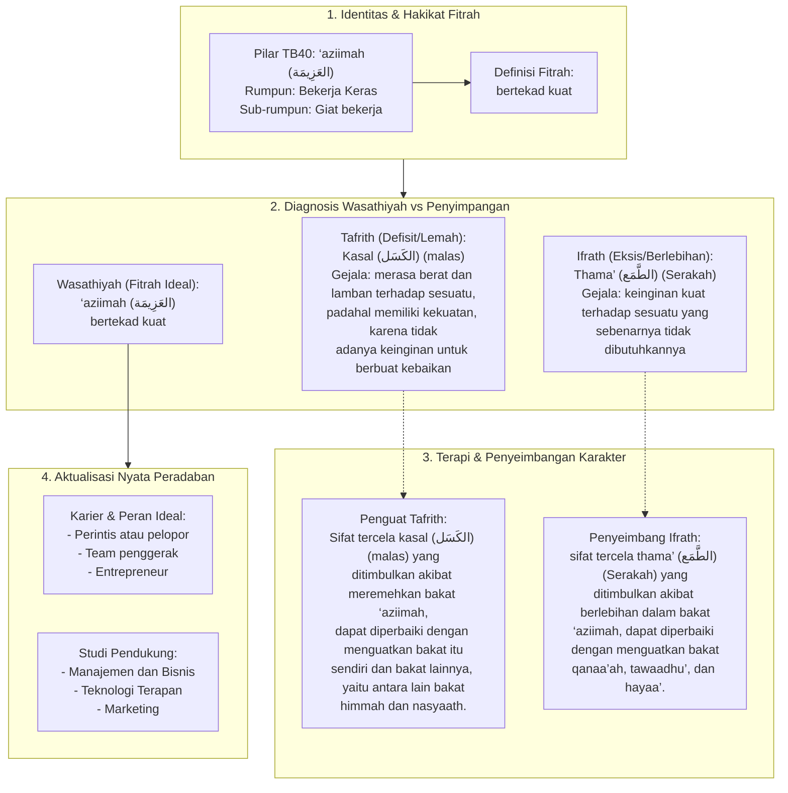

# Alur Materi: ‘Aziimah (العَزِيمَة) - Bertekad Kuat

> [!info] Artikel Lengkap
> Berkas materi lengkap: [[content/Paradigma - Implementasi PKN/Dokumen Pendidikan Karakter Nabawiyah/Paradigma & Implementasi/Insan/Fitrah (Karakter)/Bakat/TB40/05-aziimah|‘Aziimah (العَزِيمَة) - Bertekad Kuat]]

