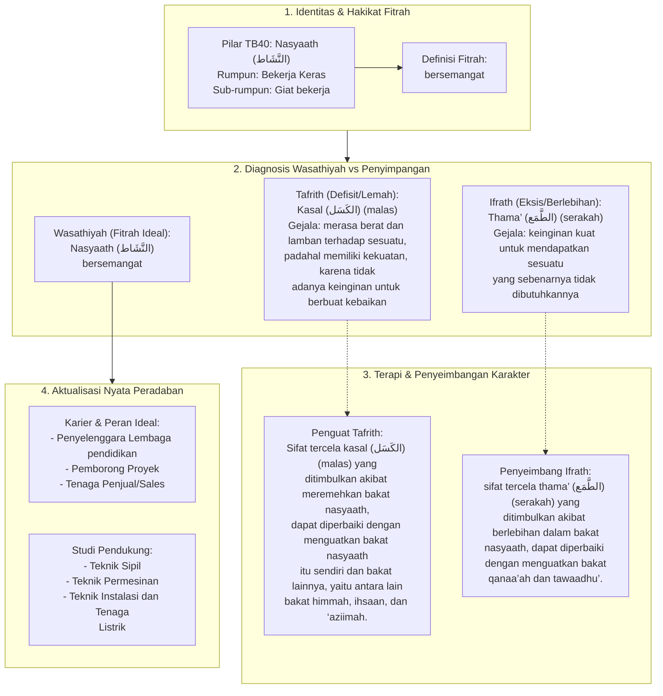

# Alur Materi: Nasyaath (النَّشَاط) - Bersemangat

> [!info] Artikel Lengkap
> Berkas materi lengkap: [[content/Paradigma - Implementasi PKN/Dokumen Pendidikan Karakter Nabawiyah/Paradigma & Implementasi/Insan/Fitrah (Karakter)/Bakat/TB40/06-nasyaath|Nasyaath (النَّشَاط) - Bersemangat]]

