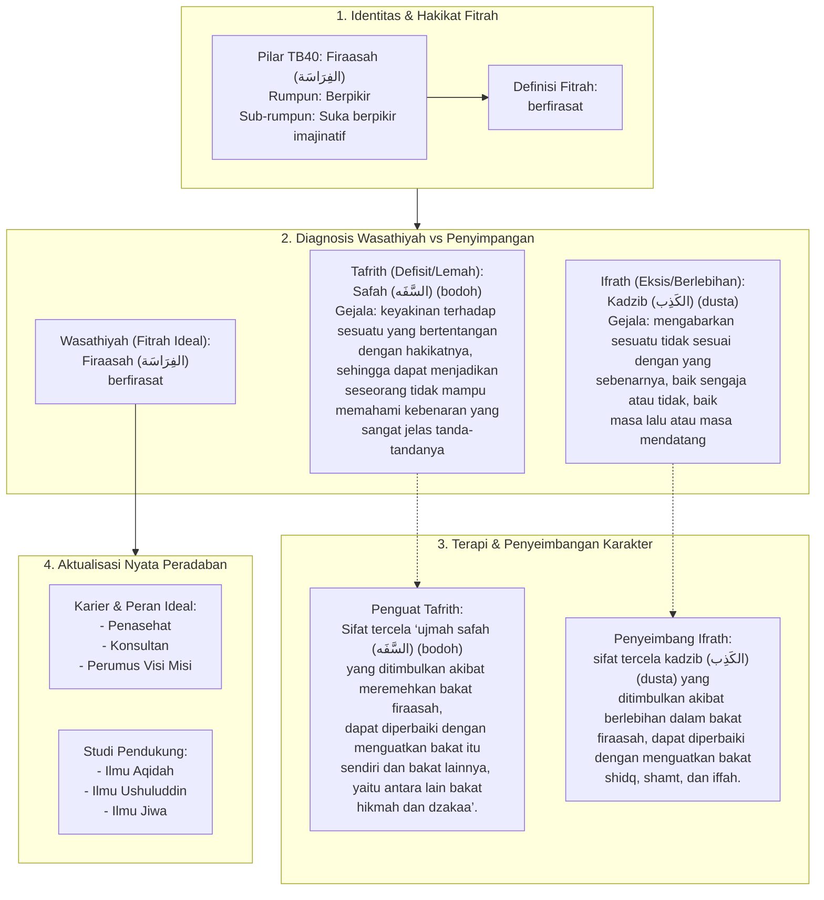

# Alur Materi: Firaasah (الفِرَاسَة) - Berfirasat

> [!info] Artikel Lengkap
> Berkas materi lengkap: [[content/Paradigma - Implementasi PKN/Dokumen Pendidikan Karakter Nabawiyah/Paradigma & Implementasi/Insan/Fitrah (Karakter)/Bakat/TB40/07-firaasah|Firaasah (الفِرَاسَة) - Berfirasat]]

