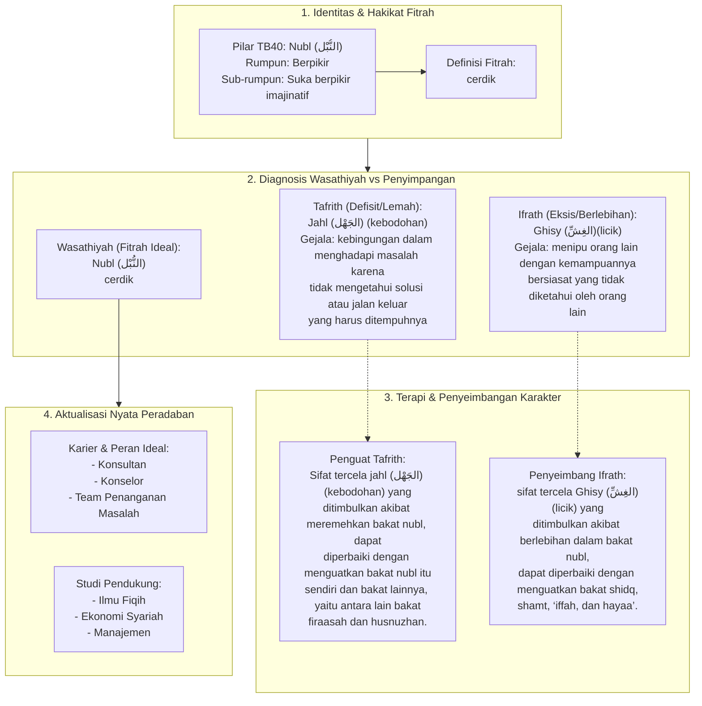

# Alur Materi: Nubl (النُّبْل) - Cerdik

> [!info] Artikel Lengkap
> Berkas materi lengkap: [[content/Paradigma - Implementasi PKN/Dokumen Pendidikan Karakter Nabawiyah/Paradigma & Implementasi/Insan/Fitrah (Karakter)/Bakat/TB40/08-nubl|Nubl (النُّبْل) - Cerdik]]

