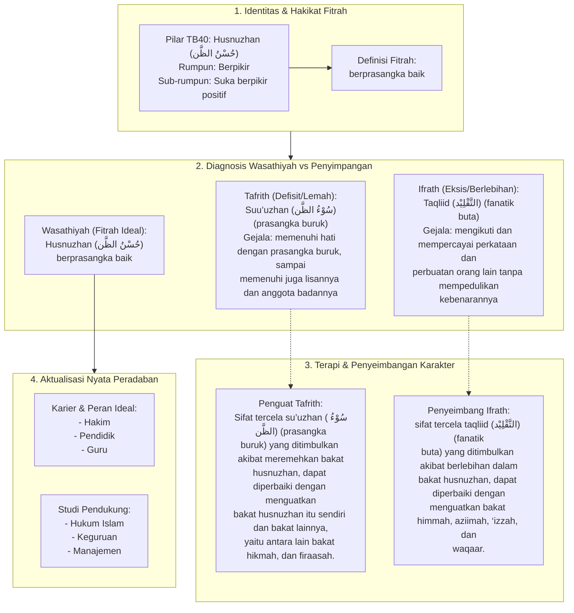

# Alur Materi: Husnuzhan (حُسْنُ الظَّن) - Berprasangka Baik

> [!info] Artikel Lengkap
> Berkas materi lengkap: [[content/Paradigma - Implementasi PKN/Dokumen Pendidikan Karakter Nabawiyah/Paradigma & Implementasi/Insan/Fitrah (Karakter)/Bakat/TB40/09-husnuzhan|Husnuzhan (حُسْنُ الظَّن) - Berprasangka Baik]]

