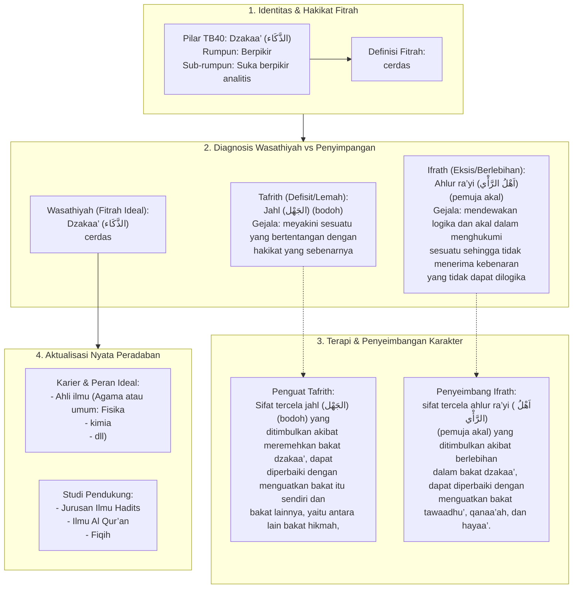

# Alur Materi: Dzakaa’ (الذَّكَاء) - Cerdas

> [!info] Artikel Lengkap
> Berkas materi lengkap: [[content/Paradigma - Implementasi PKN/Dokumen Pendidikan Karakter Nabawiyah/Paradigma & Implementasi/Insan/Fitrah (Karakter)/Bakat/TB40/10-dzakaa|Dzakaa’ (الذَّكَاء) - Cerdas]]

