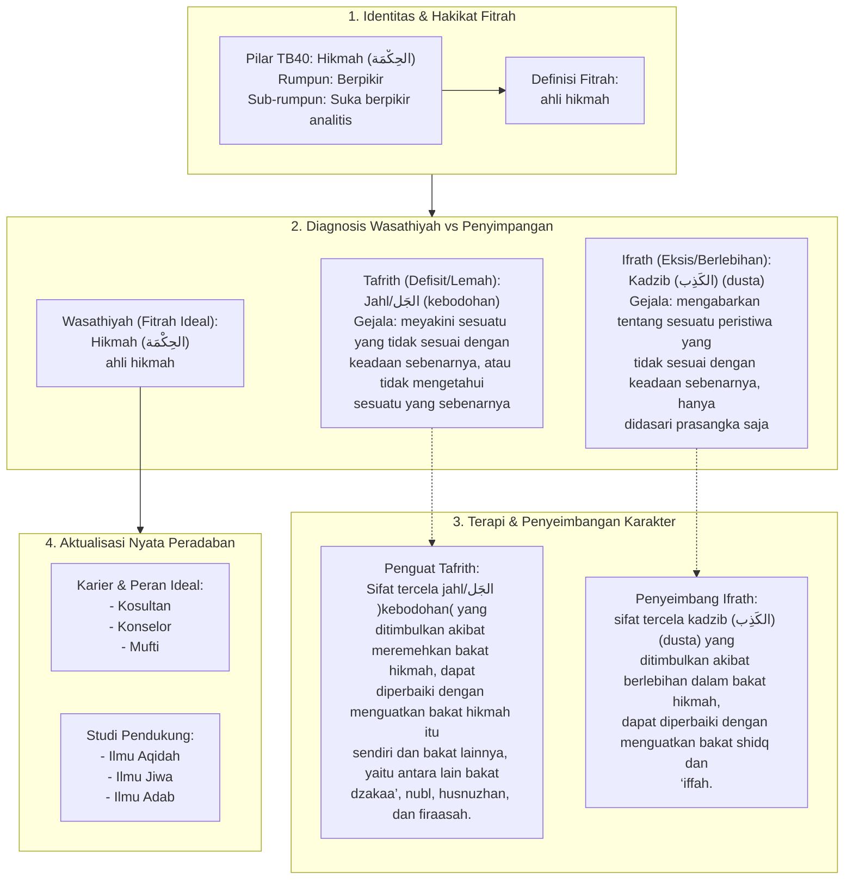

# Alur Materi: Hikmah (الحِكْمَة) - Ahli Hikmah

> [!info] Artikel Lengkap
> Berkas materi lengkap: [[content/Paradigma - Implementasi PKN/Dokumen Pendidikan Karakter Nabawiyah/Paradigma & Implementasi/Insan/Fitrah (Karakter)/Bakat/TB40/11-hikmah|Hikmah (الحِكْمَة) - Ahli Hikmah]]

