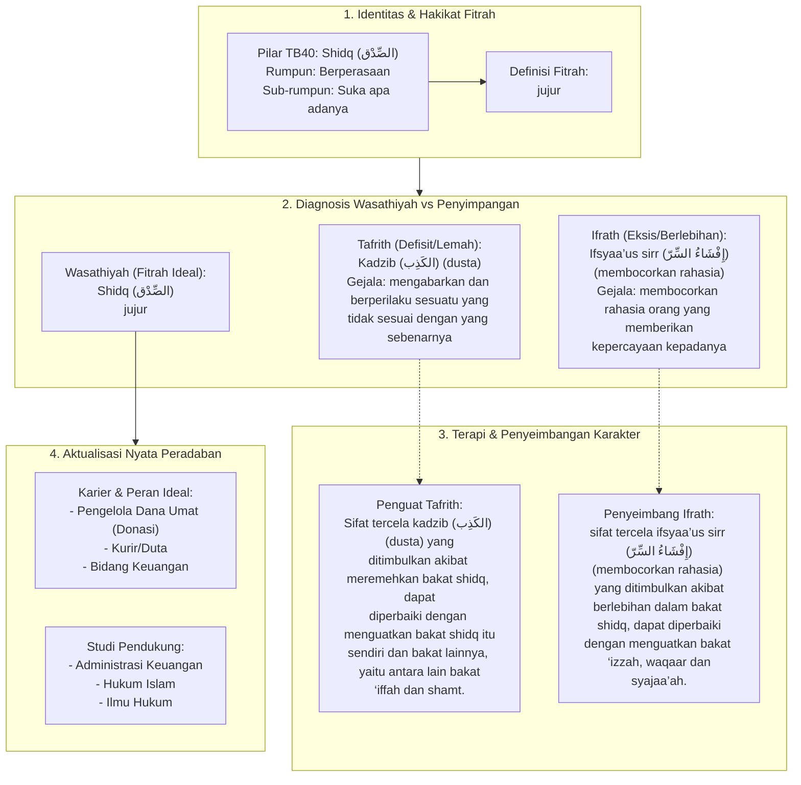

# Alur Materi: Shidq (الصِّدْق) - Jujur

> [!info] Artikel Lengkap
> Berkas materi lengkap: [[content/Paradigma - Implementasi PKN/Dokumen Pendidikan Karakter Nabawiyah/Paradigma & Implementasi/Insan/Fitrah (Karakter)/Bakat/TB40/12-shidq|Shidq (الصِّدْق) - Jujur]]

