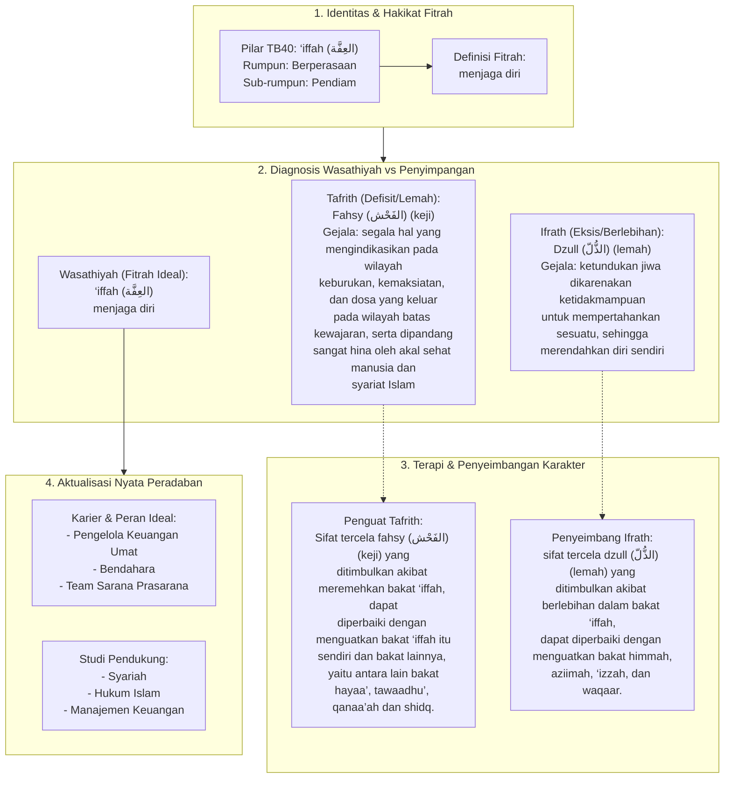

# Alur Materi: ‘Iffah (العِفَّة) - Menjaga Diri

> [!info] Artikel Lengkap
> Berkas materi lengkap: [[content/Paradigma - Implementasi PKN/Dokumen Pendidikan Karakter Nabawiyah/Paradigma & Implementasi/Insan/Fitrah (Karakter)/Bakat/TB40/13-iffah|‘Iffah (العِفَّة) - Menjaga Diri]]

