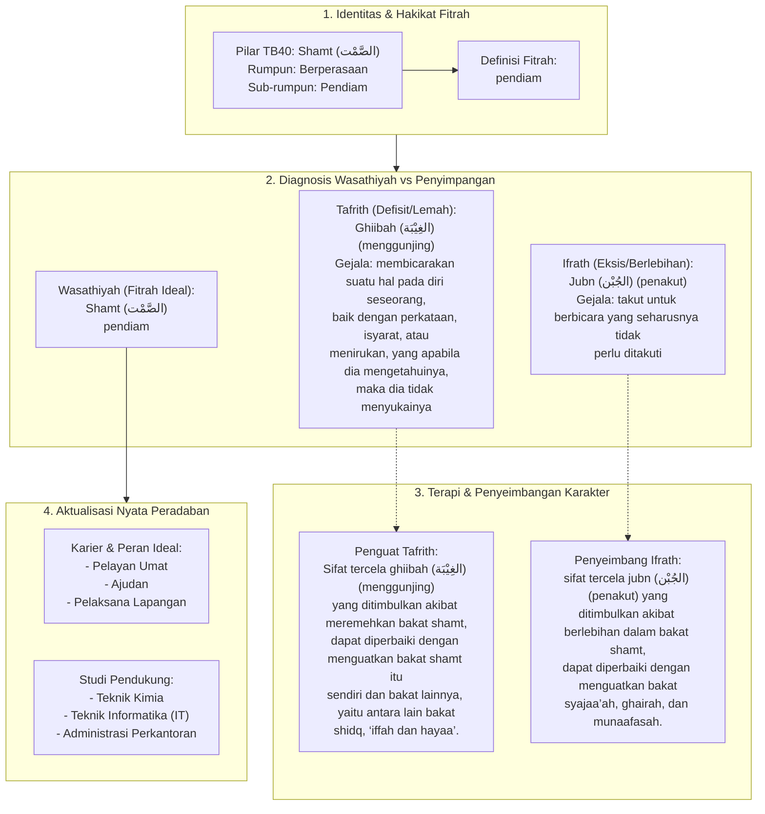

# Alur Materi: Shamt (الصَّمْت) - Pendiam

> [!info] Artikel Lengkap
> Berkas materi lengkap: [[content/Paradigma - Implementasi PKN/Dokumen Pendidikan Karakter Nabawiyah/Paradigma & Implementasi/Insan/Fitrah (Karakter)/Bakat/TB40/14-shamt|Shamt (الصَّمْت) - Pendiam]]

