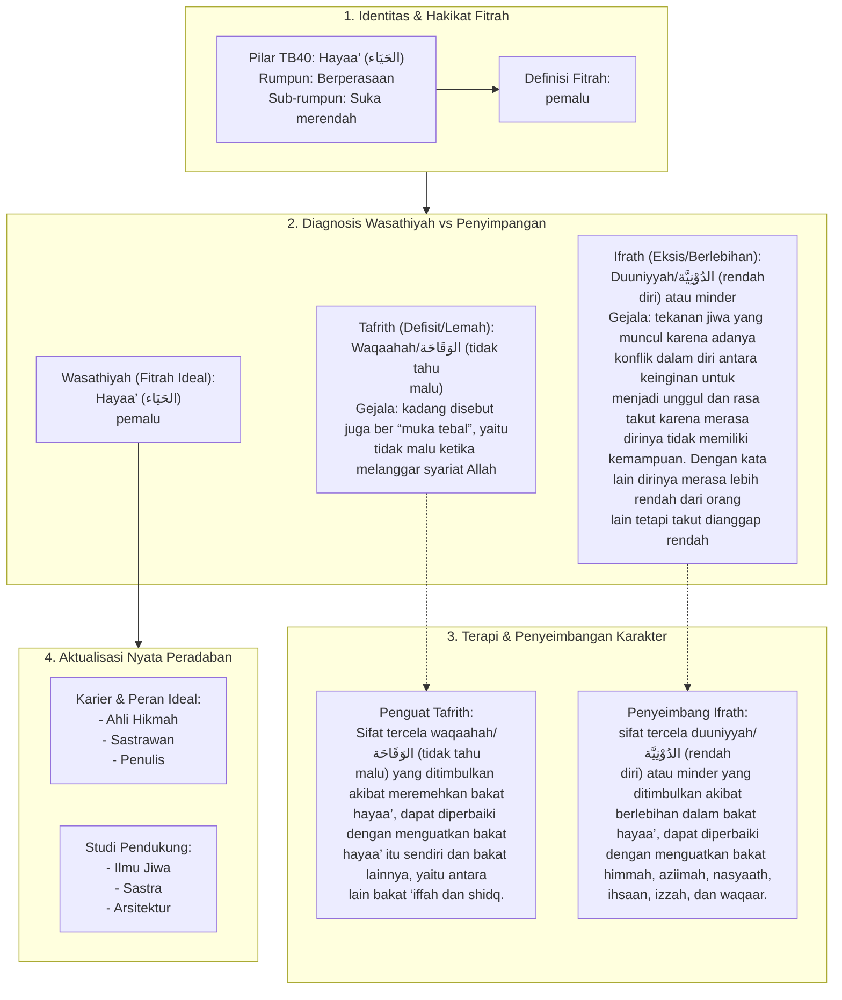

# Alur Materi: Hayaa’ (الحَيَاء) - Pemalu

> [!info] Artikel Lengkap
> Berkas materi lengkap: [[content/Paradigma - Implementasi PKN/Dokumen Pendidikan Karakter Nabawiyah/Paradigma & Implementasi/Insan/Fitrah (Karakter)/Bakat/TB40/15-hayaa|Hayaa’ (الحَيَاء) - Pemalu]]

