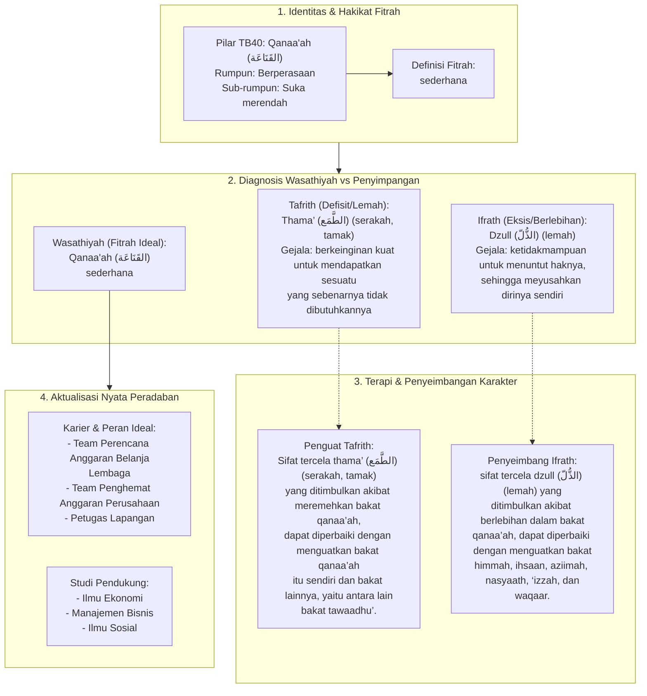

# Alur Materi: Qanaa'Ah (القَنَاعَة) - Sederhana

> [!info] Artikel Lengkap
> Berkas materi lengkap: [[content/Paradigma - Implementasi PKN/Dokumen Pendidikan Karakter Nabawiyah/Paradigma & Implementasi/Insan/Fitrah (Karakter)/Bakat/TB40/16-qanaaah|Qanaa'Ah (القَنَاعَة) - Sederhana]]

