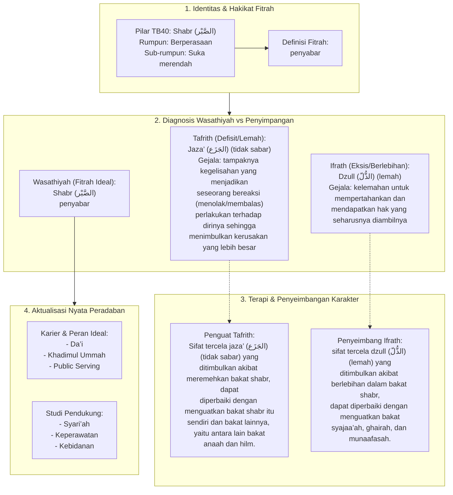

# Alur Materi: Shabr (الصَّبْر) - Penyabar

> [!info] Artikel Lengkap
> Berkas materi lengkap: [[content/Paradigma - Implementasi PKN/Dokumen Pendidikan Karakter Nabawiyah/Paradigma & Implementasi/Insan/Fitrah (Karakter)/Bakat/TB40/17-shabr|Shabr (الصَّبْر) - Penyabar]]

