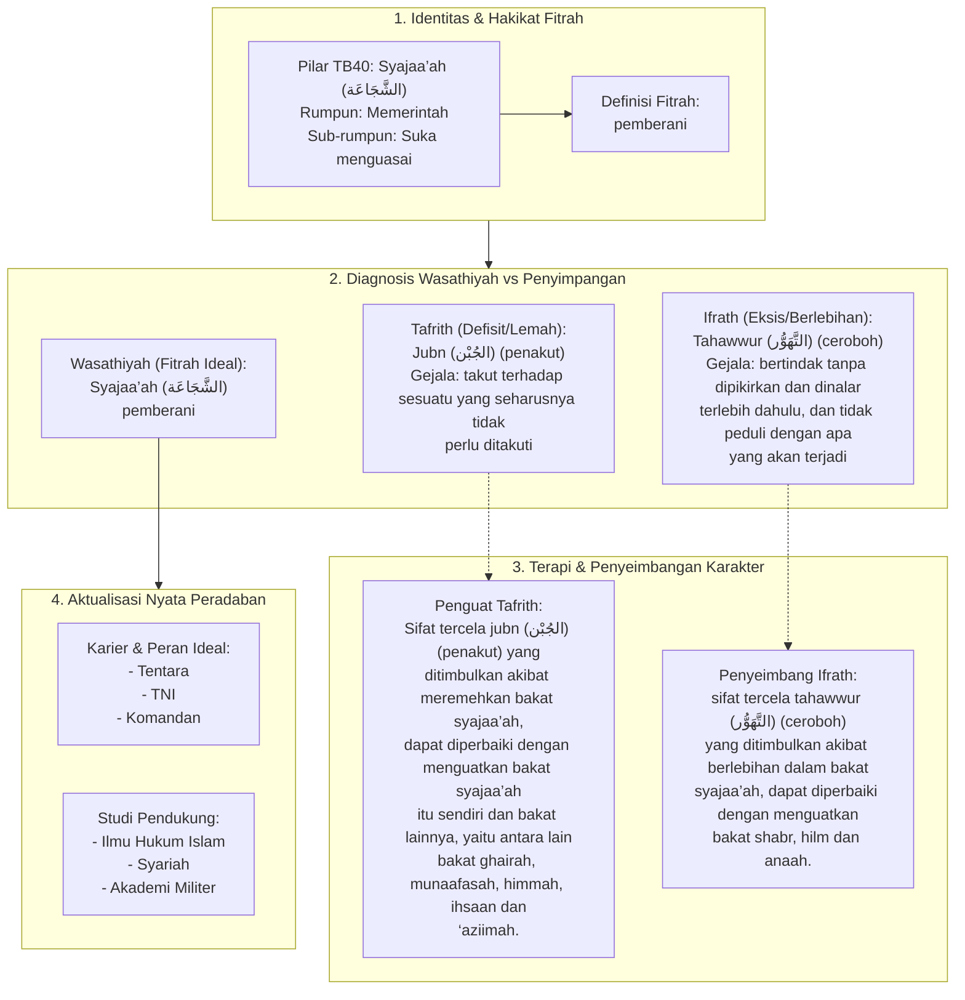

# Alur Materi: Syajaa’Ah (الشَّجَاعَة) - Pemberani

> [!info] Artikel Lengkap
> Berkas materi lengkap: [[content/Paradigma - Implementasi PKN/Dokumen Pendidikan Karakter Nabawiyah/Paradigma & Implementasi/Insan/Fitrah (Karakter)/Bakat/TB40/18-syajaaah|Syajaa’Ah (الشَّجَاعَة) - Pemberani]]

