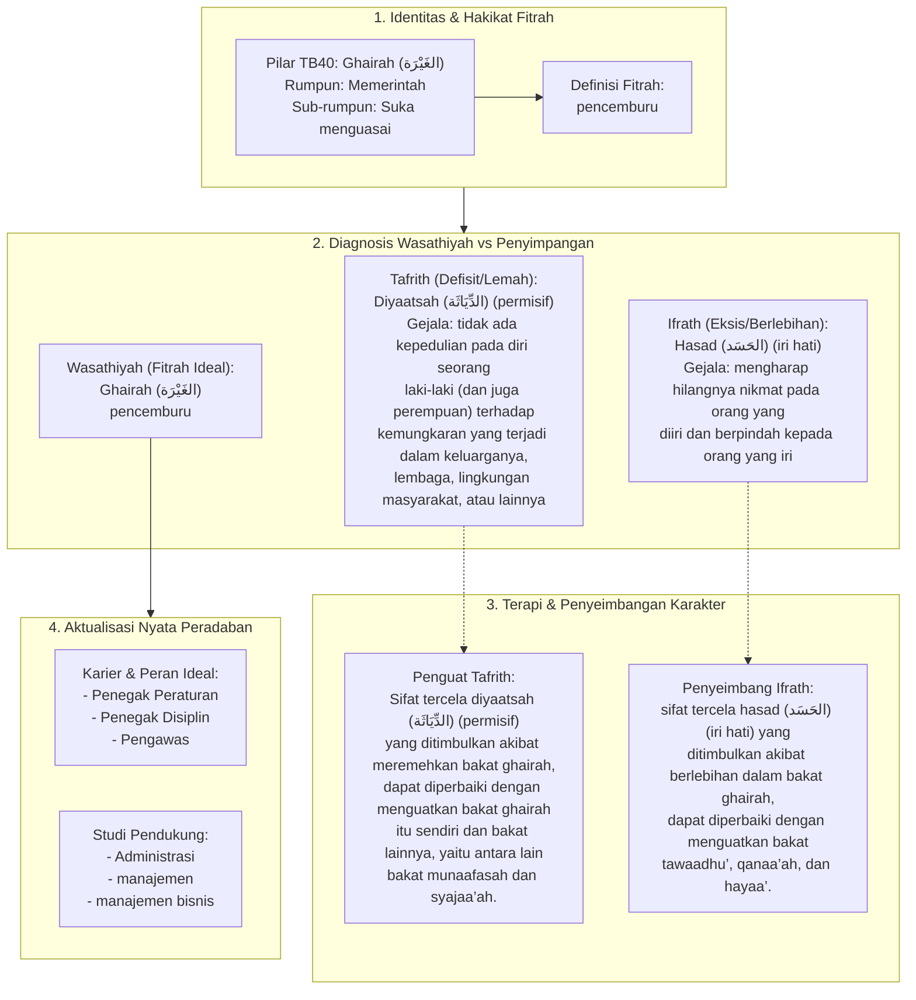

# Alur Materi: Ghairah (الغَيْرَة) - Pencemburu

> [!info] Artikel Lengkap
> Berkas materi lengkap: [[content/Paradigma - Implementasi PKN/Dokumen Pendidikan Karakter Nabawiyah/Paradigma & Implementasi/Insan/Fitrah (Karakter)/Bakat/TB40/19-ghairah|Ghairah (الغَيْرَة) - Pencemburu]]

