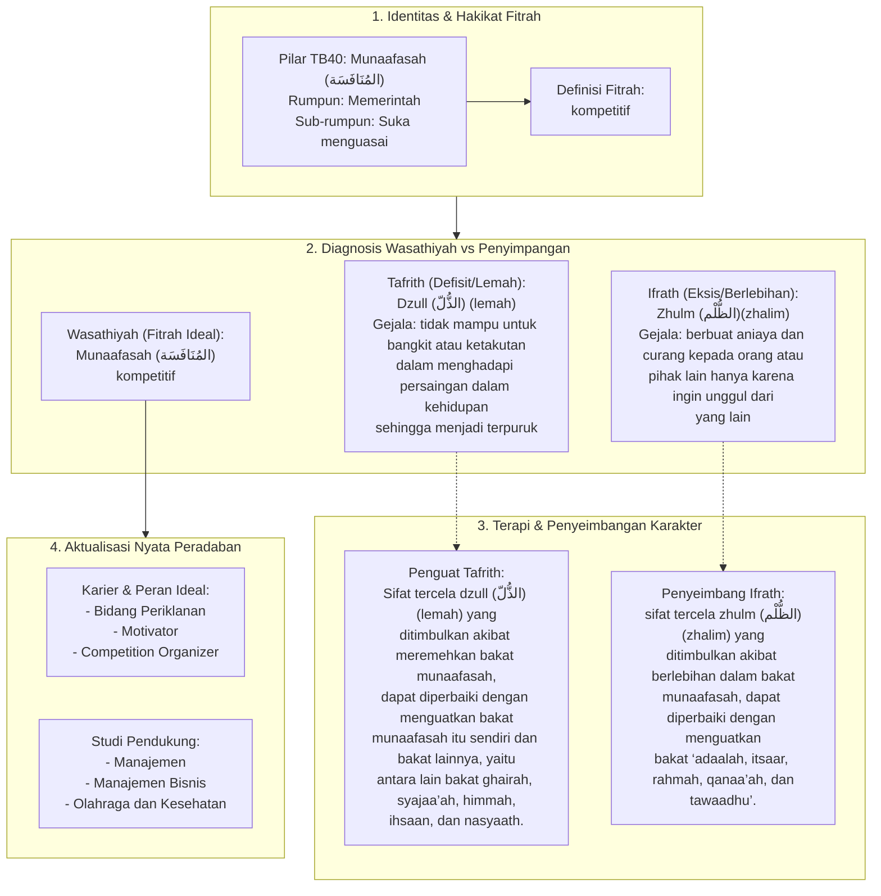

# Alur Materi: Munaafasah (المُنَافَسَة) - Kompetitif

> [!info] Artikel Lengkap
> Berkas materi lengkap: [[content/Paradigma - Implementasi PKN/Dokumen Pendidikan Karakter Nabawiyah/Paradigma & Implementasi/Insan/Fitrah (Karakter)/Bakat/TB40/20-munaafasah|Munaafasah (المُنَافَسَة) - Kompetitif]]

