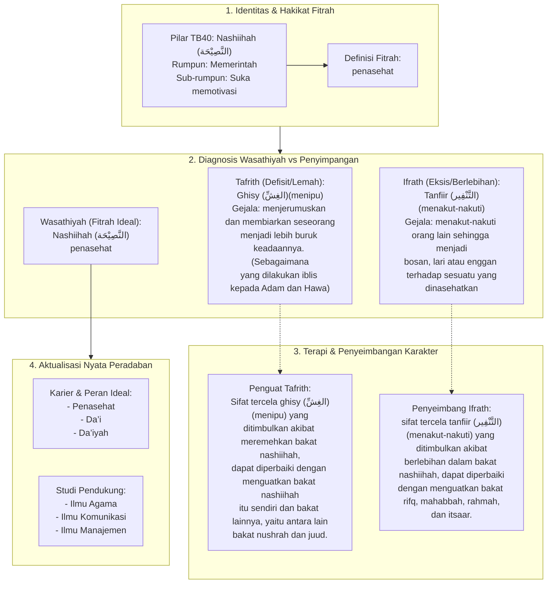

# Alur Materi: Nashiihah (النَّصِيْحَة) - Penasehat

> [!info] Artikel Lengkap
> Berkas materi lengkap: [[content/Paradigma - Implementasi PKN/Dokumen Pendidikan Karakter Nabawiyah/Paradigma & Implementasi/Insan/Fitrah (Karakter)/Bakat/TB40/21-nashiihah|Nashiihah (النَّصِيْحَة) - Penasehat]]

