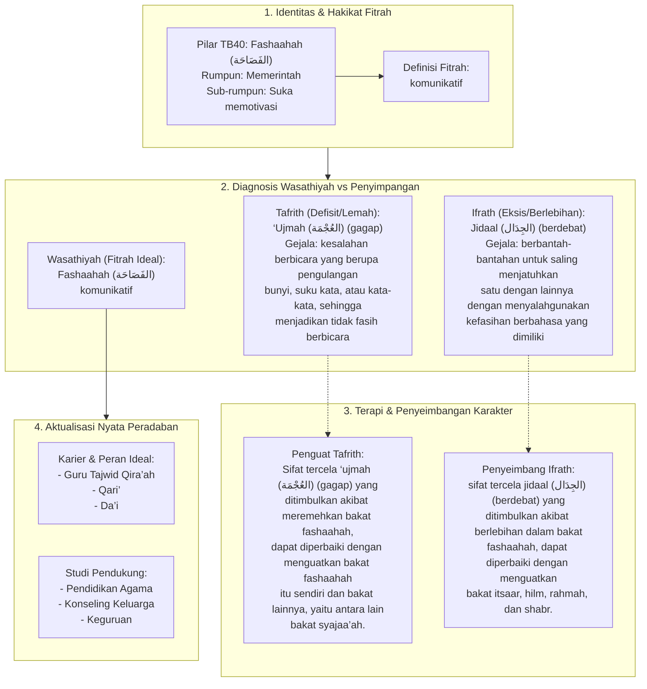

# Alur Materi: Fashaahah (الفَصَاحَة) - Komunikatif

> [!info] Artikel Lengkap
> Berkas materi lengkap: [[content/Paradigma - Implementasi PKN/Dokumen Pendidikan Karakter Nabawiyah/Paradigma & Implementasi/Insan/Fitrah (Karakter)/Bakat/TB40/22-fashaahah|Fashaahah (الفَصَاحَة) - Komunikatif]]

