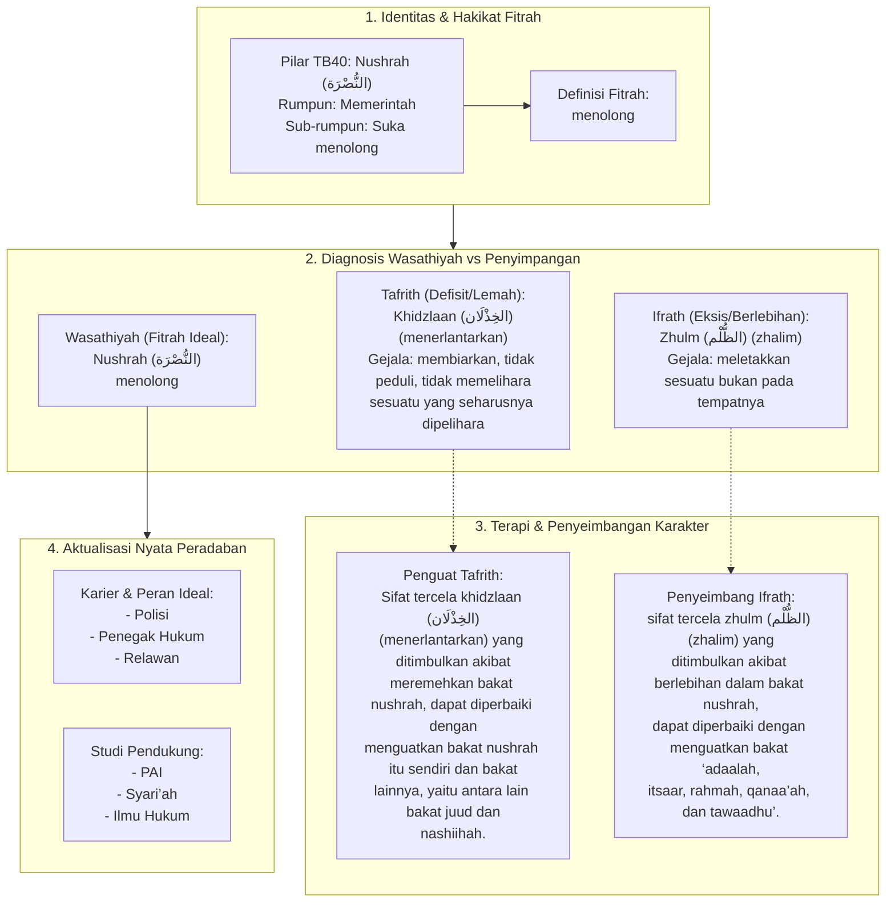

# Alur Materi: Nushrah (النُّصْرَة) - Menolong

> [!info] Artikel Lengkap
> Berkas materi lengkap: [[content/Paradigma - Implementasi PKN/Dokumen Pendidikan Karakter Nabawiyah/Paradigma & Implementasi/Insan/Fitrah (Karakter)/Bakat/TB40/23-nushrah|Nushrah (النُّصْرَة) - Menolong]]

