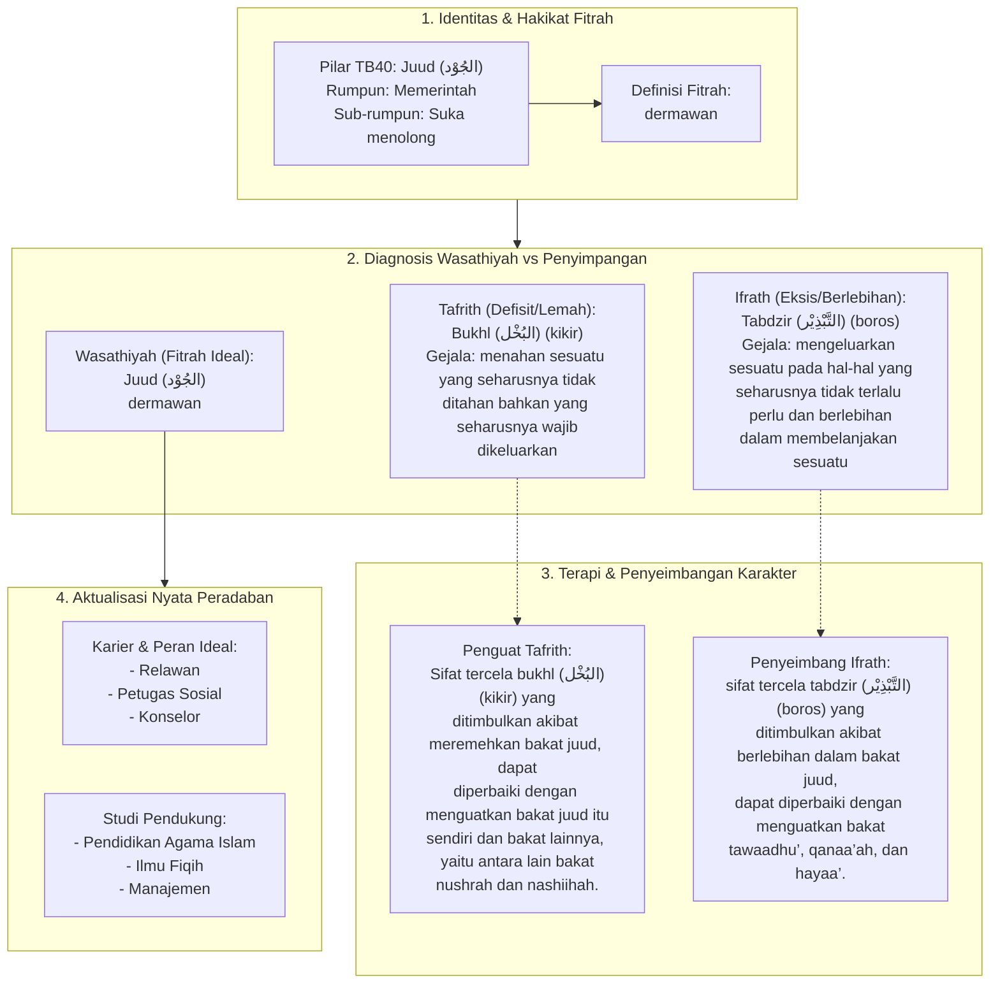

# Alur Materi: Juud (الجُوْد) - Dermawan

> [!info] Artikel Lengkap
> Berkas materi lengkap: [[content/Paradigma - Implementasi PKN/Dokumen Pendidikan Karakter Nabawiyah/Paradigma & Implementasi/Insan/Fitrah (Karakter)/Bakat/TB40/24-juud|Juud (الجُوْد) - Dermawan]]

