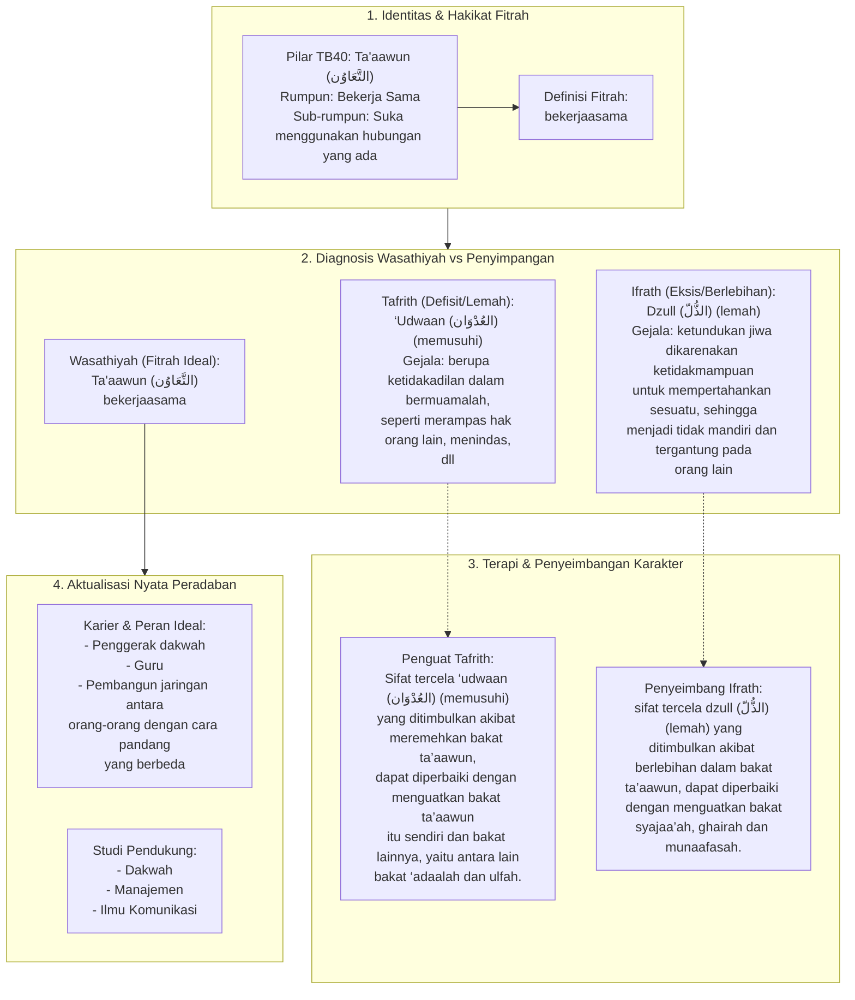

# Alur Materi: Ta'Aawun (التَّعَاوُن) - Bekerjaasama

> [!info] Artikel Lengkap
> Berkas materi lengkap: [[content/Paradigma - Implementasi PKN/Dokumen Pendidikan Karakter Nabawiyah/Paradigma & Implementasi/Insan/Fitrah (Karakter)/Bakat/TB40/25-taaawun|Ta'Aawun (التَّعَاوُن) - Bekerjaasama]]

