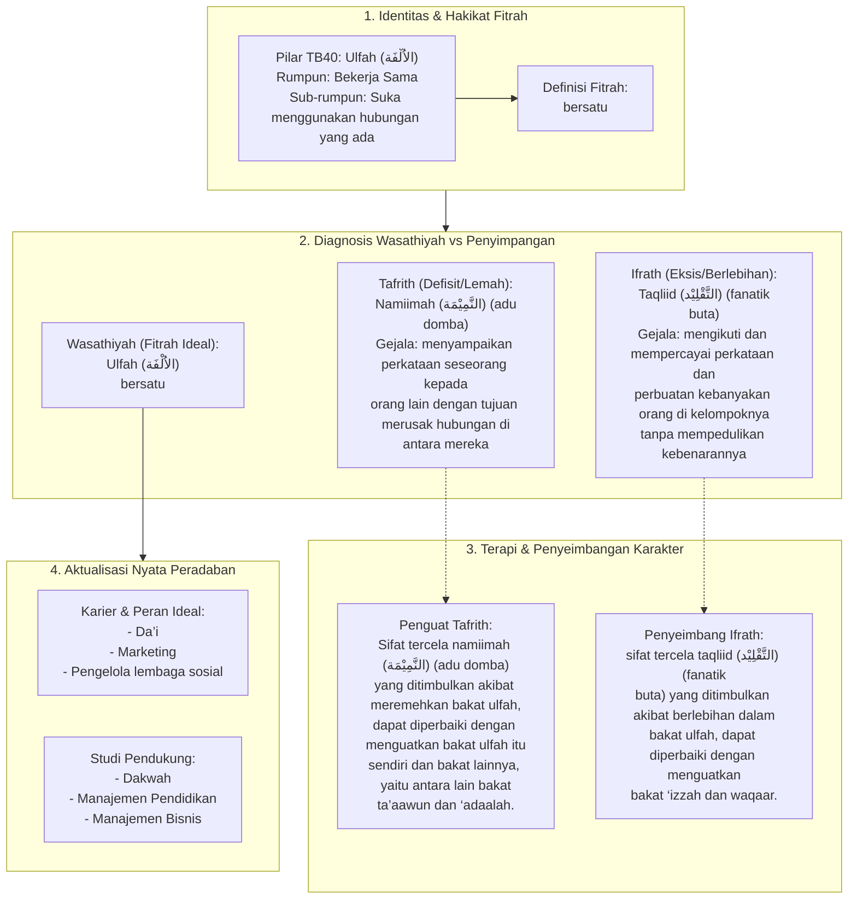

# Alur Materi: Ulfah (الاُلْفَة) - Bersatu

> [!info] Artikel Lengkap
> Berkas materi lengkap: [[content/Paradigma - Implementasi PKN/Dokumen Pendidikan Karakter Nabawiyah/Paradigma & Implementasi/Insan/Fitrah (Karakter)/Bakat/TB40/26-ulfah|Ulfah (الاُلْفَة) - Bersatu]]

