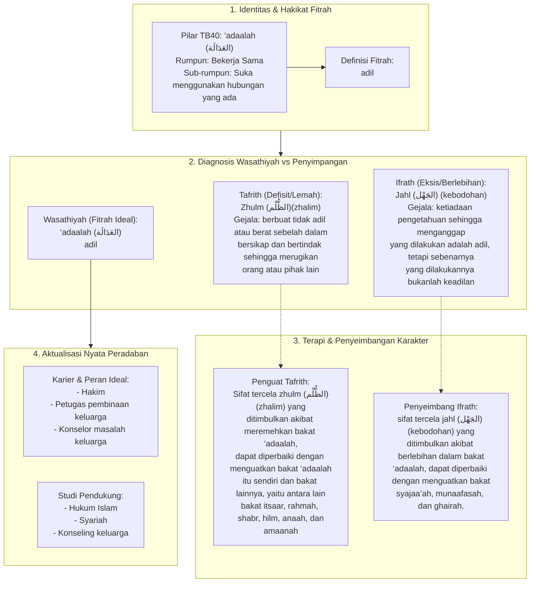

# Alur Materi: ‘Adaalah (العَدَالَة) - Adil

> [!info] Artikel Lengkap
> Berkas materi lengkap: [[content/Paradigma - Implementasi PKN/Dokumen Pendidikan Karakter Nabawiyah/Paradigma & Implementasi/Insan/Fitrah (Karakter)/Bakat/TB40/27-adaalah|‘Adaalah (العَدَالَة) - Adil]]

