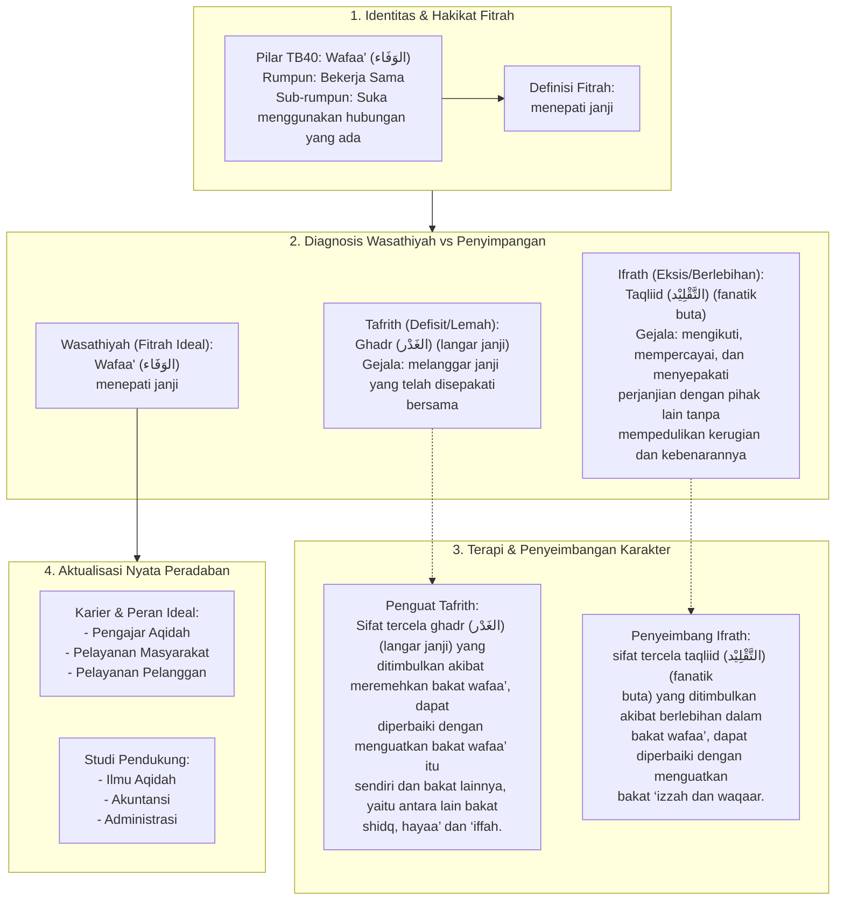

# Alur Materi: Wafaa' (الوَفَاء) - Menepati Janji

> [!info] Artikel Lengkap
> Berkas materi lengkap: [[content/Paradigma - Implementasi PKN/Dokumen Pendidikan Karakter Nabawiyah/Paradigma & Implementasi/Insan/Fitrah (Karakter)/Bakat/TB40/28-wafaa|Wafaa' (الوَفَاء) - Menepati Janji]]

