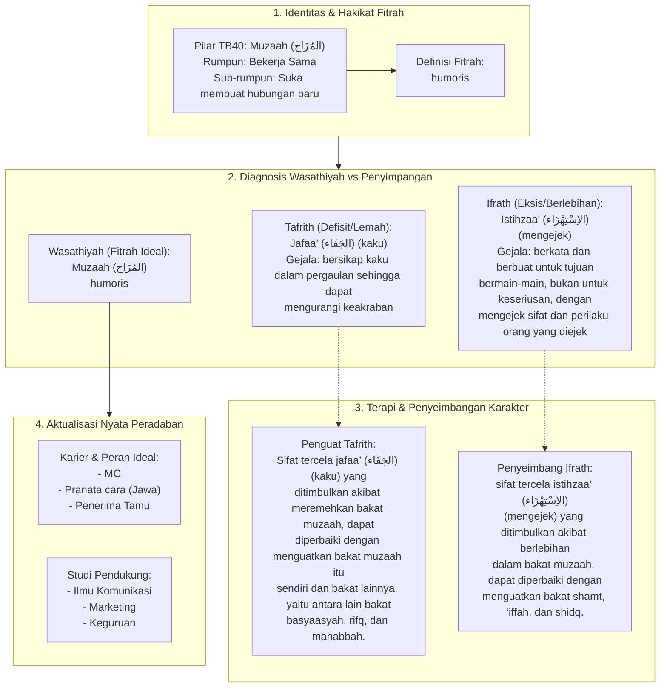

# Alur Materi: Muzaah (المُزَاح) - Humoris

> [!info] Artikel Lengkap
> Berkas materi lengkap: [[content/Paradigma - Implementasi PKN/Dokumen Pendidikan Karakter Nabawiyah/Paradigma & Implementasi/Insan/Fitrah (Karakter)/Bakat/TB40/29-muzaah|Muzaah (المُزَاح) - Humoris]]

