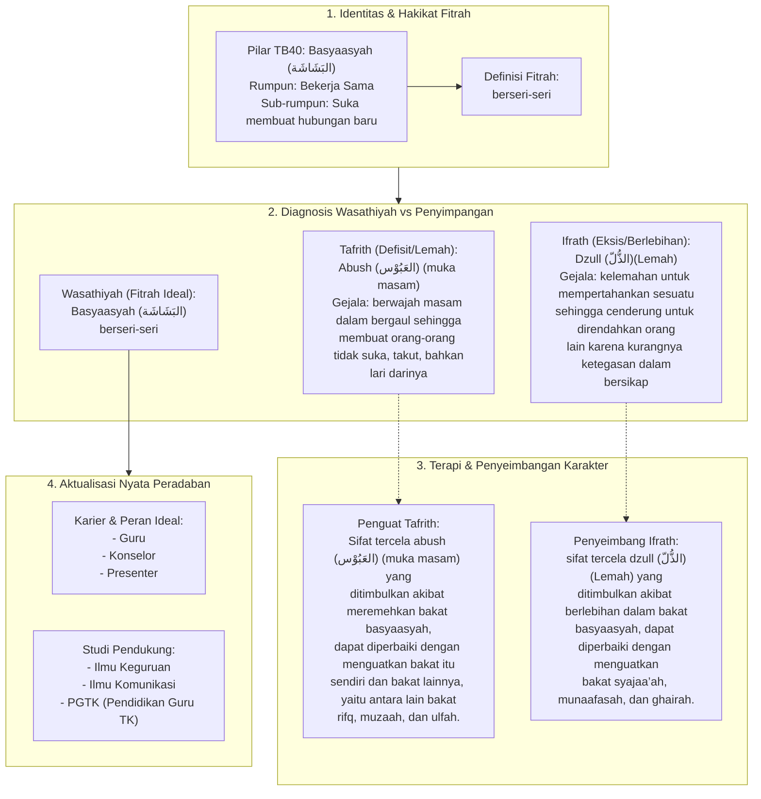

# Alur Materi: Basyaasyah (البَشَاشَة) - Berseri-Seri

> [!info] Artikel Lengkap
> Berkas materi lengkap: [[content/Paradigma - Implementasi PKN/Dokumen Pendidikan Karakter Nabawiyah/Paradigma & Implementasi/Insan/Fitrah (Karakter)/Bakat/TB40/30-basyaasyah|Basyaasyah (البَشَاشَة) - Berseri-Seri]]

