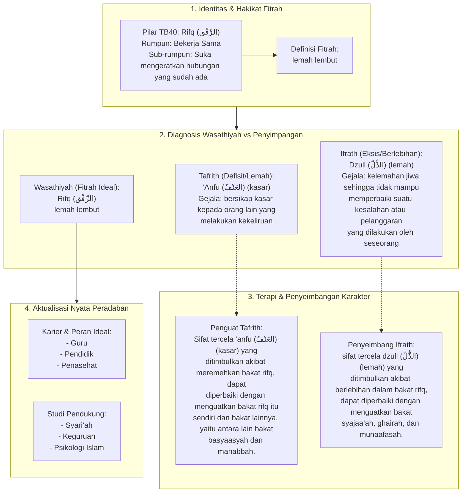

# Alur Materi: Rifq (الرِّفْق) - Lemah Lembut

> [!info] Artikel Lengkap
> Berkas materi lengkap: [[content/Paradigma - Implementasi PKN/Dokumen Pendidikan Karakter Nabawiyah/Paradigma & Implementasi/Insan/Fitrah (Karakter)/Bakat/TB40/31-rifq|Rifq (الرِّفْق) - Lemah Lembut]]

