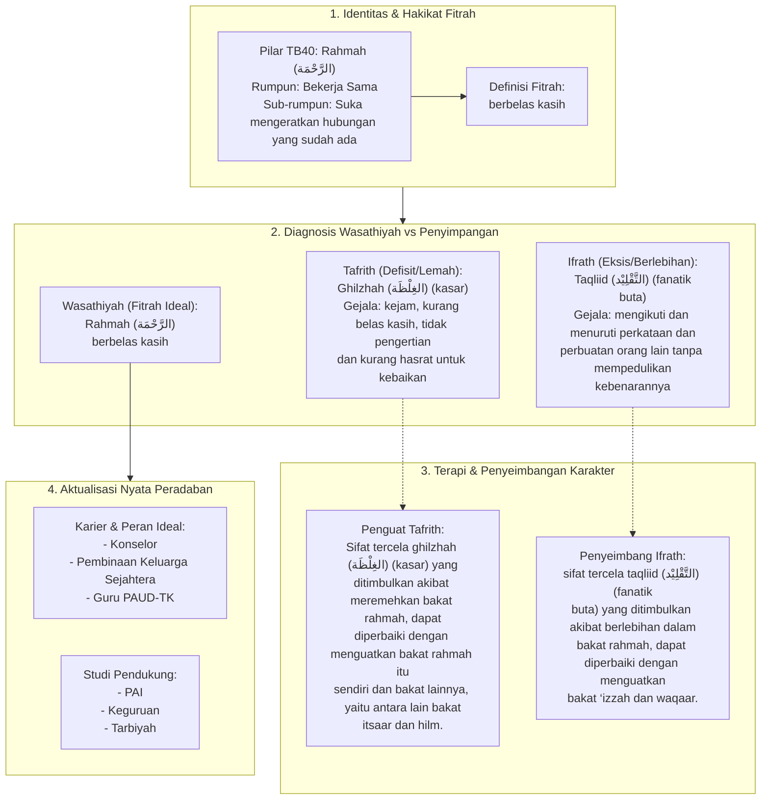

# Alur Materi: Rahmah (الرَّحْمَة) - Berbelas Kasih

> [!info] Artikel Lengkap
> Berkas materi lengkap: [[content/Paradigma - Implementasi PKN/Dokumen Pendidikan Karakter Nabawiyah/Paradigma & Implementasi/Insan/Fitrah (Karakter)/Bakat/TB40/32-rahmah|Rahmah (الرَّحْمَة) - Berbelas Kasih]]

