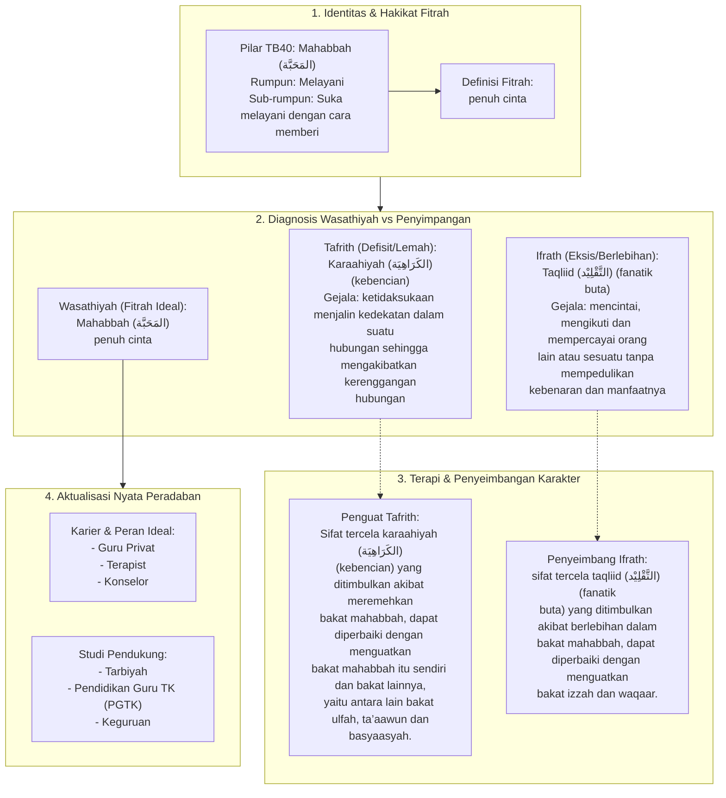

# Alur Materi: Mahabbah (المَحَبَّة) - Penuh Cinta

> [!info] Artikel Lengkap
> Berkas materi lengkap: [[content/Paradigma - Implementasi PKN/Dokumen Pendidikan Karakter Nabawiyah/Paradigma & Implementasi/Insan/Fitrah (Karakter)/Bakat/TB40/33-mahabbah|Mahabbah (المَحَبَّة) - Penuh Cinta]]

