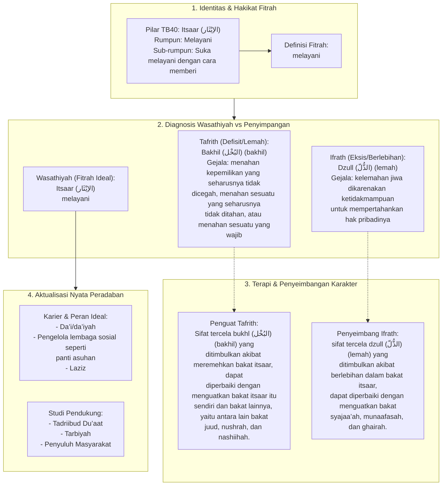

# Alur Materi: Itsaar (الاِيْثَار) - Melayani

> [!info] Artikel Lengkap
> Berkas materi lengkap: [[content/Paradigma - Implementasi PKN/Dokumen Pendidikan Karakter Nabawiyah/Paradigma & Implementasi/Insan/Fitrah (Karakter)/Bakat/TB40/34-itsaar|Itsaar (الاِيْثَار) - Melayani]]

