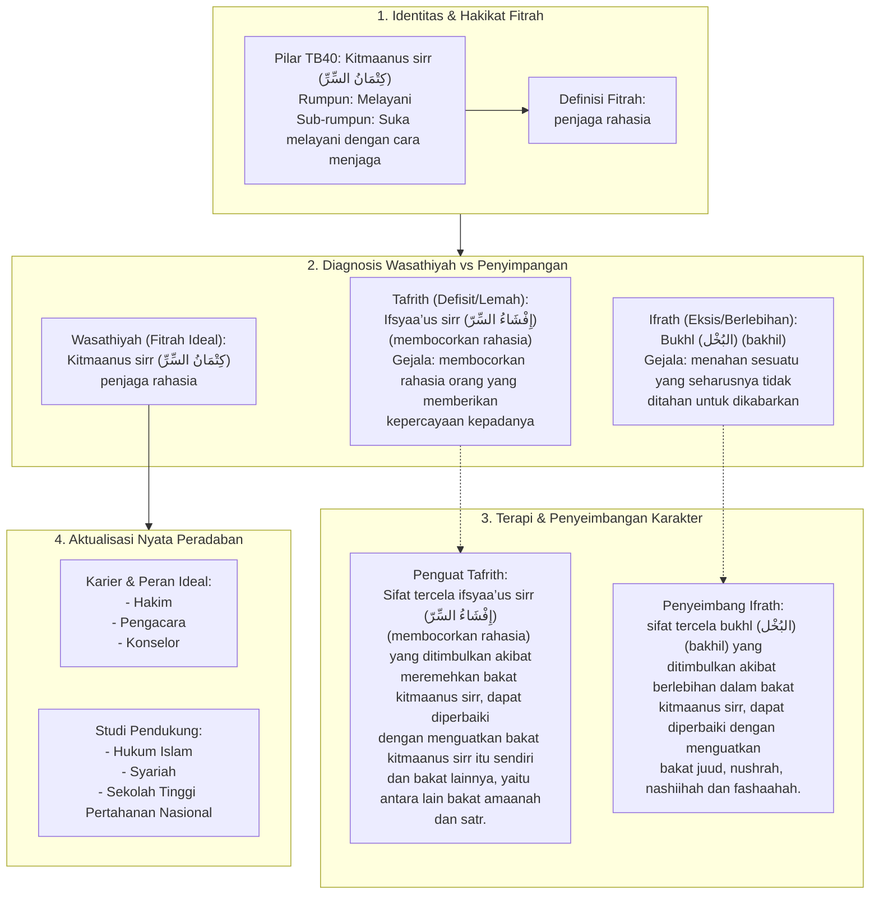

# Alur Materi: Kitmaanus Sirr (كِتْمَانُ السِّرِّ) - Penjaga Rahasia

> [!info] Artikel Lengkap
> Berkas materi lengkap: [[content/Paradigma - Implementasi PKN/Dokumen Pendidikan Karakter Nabawiyah/Paradigma & Implementasi/Insan/Fitrah (Karakter)/Bakat/TB40/35-kitmaanus-sirr|Kitmaanus Sirr (كِتْمَانُ السِّرِّ) - Penjaga Rahasia]]

