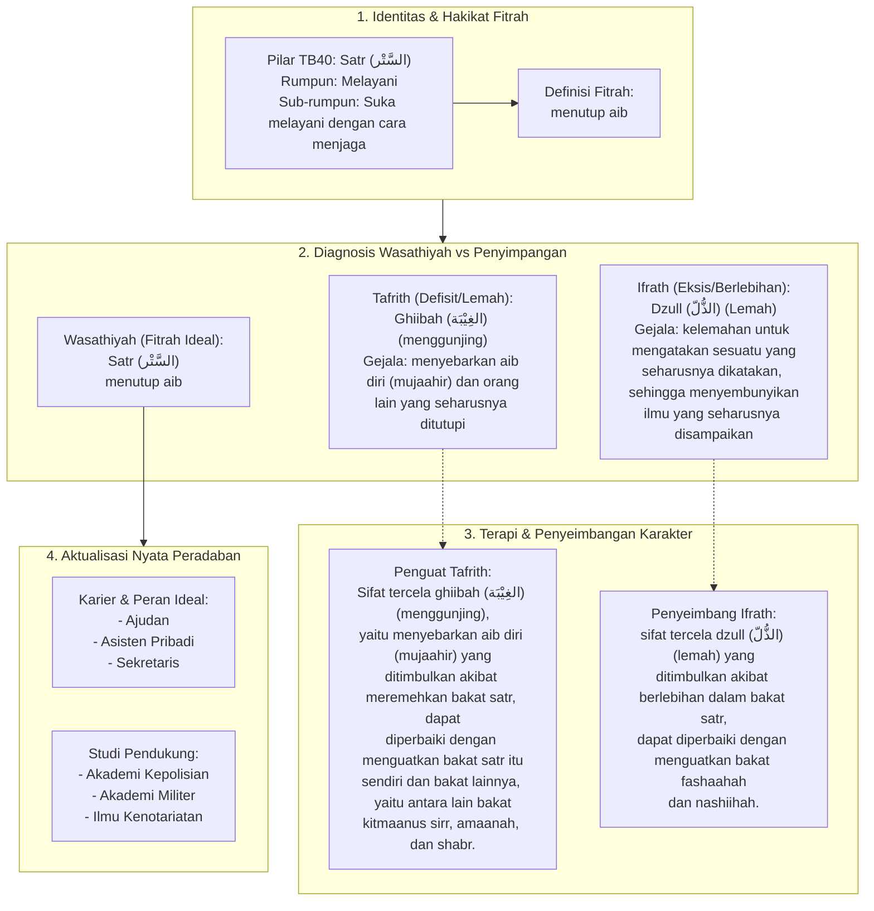

# Alur Materi: Satr (السَّتْر) - Menutup Aib

> [!info] Artikel Lengkap
> Berkas materi lengkap: [[content/Paradigma - Implementasi PKN/Dokumen Pendidikan Karakter Nabawiyah/Paradigma & Implementasi/Insan/Fitrah (Karakter)/Bakat/TB40/36-satr|Satr (السَّتْر) - Menutup Aib]]

