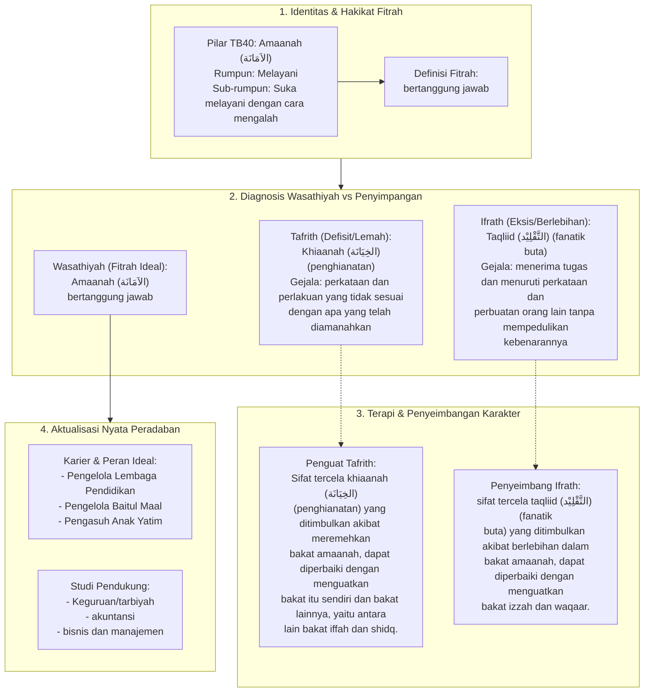

# Alur Materi: Amaanah (الاَمَانَة) - Bertanggung Jawab

> [!info] Artikel Lengkap
> Berkas materi lengkap: [[content/Paradigma - Implementasi PKN/Dokumen Pendidikan Karakter Nabawiyah/Paradigma & Implementasi/Insan/Fitrah (Karakter)/Bakat/TB40/37-amaanah|Amaanah (الاَمَانَة) - Bertanggung Jawab]]

