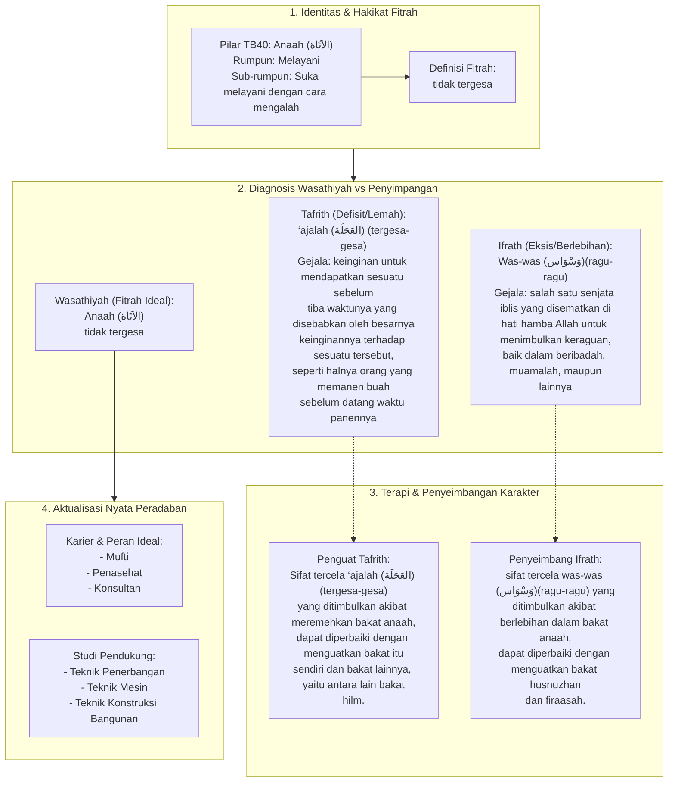

# Alur Materi: Anaah (الاَنَاة) - Tidak Tergesa

> [!info] Artikel Lengkap
> Berkas materi lengkap: [[content/Paradigma - Implementasi PKN/Dokumen Pendidikan Karakter Nabawiyah/Paradigma & Implementasi/Insan/Fitrah (Karakter)/Bakat/TB40/38-anaah|Anaah (الاَنَاة) - Tidak Tergesa]]

