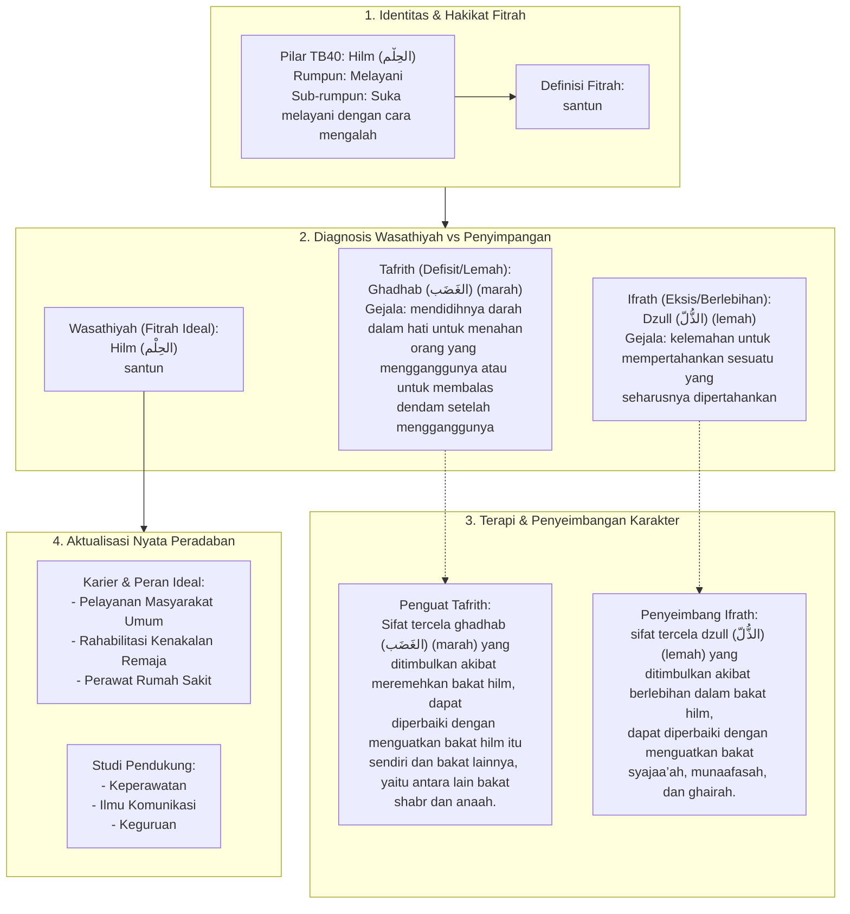

# Alur Materi: Hilm (الحِلْم) - Santun

> [!info] Artikel Lengkap
> Berkas materi lengkap: [[content/Paradigma - Implementasi PKN/Dokumen Pendidikan Karakter Nabawiyah/Paradigma & Implementasi/Insan/Fitrah (Karakter)/Bakat/TB40/39-hilm|Hilm (الحِلْم) - Santun]]

