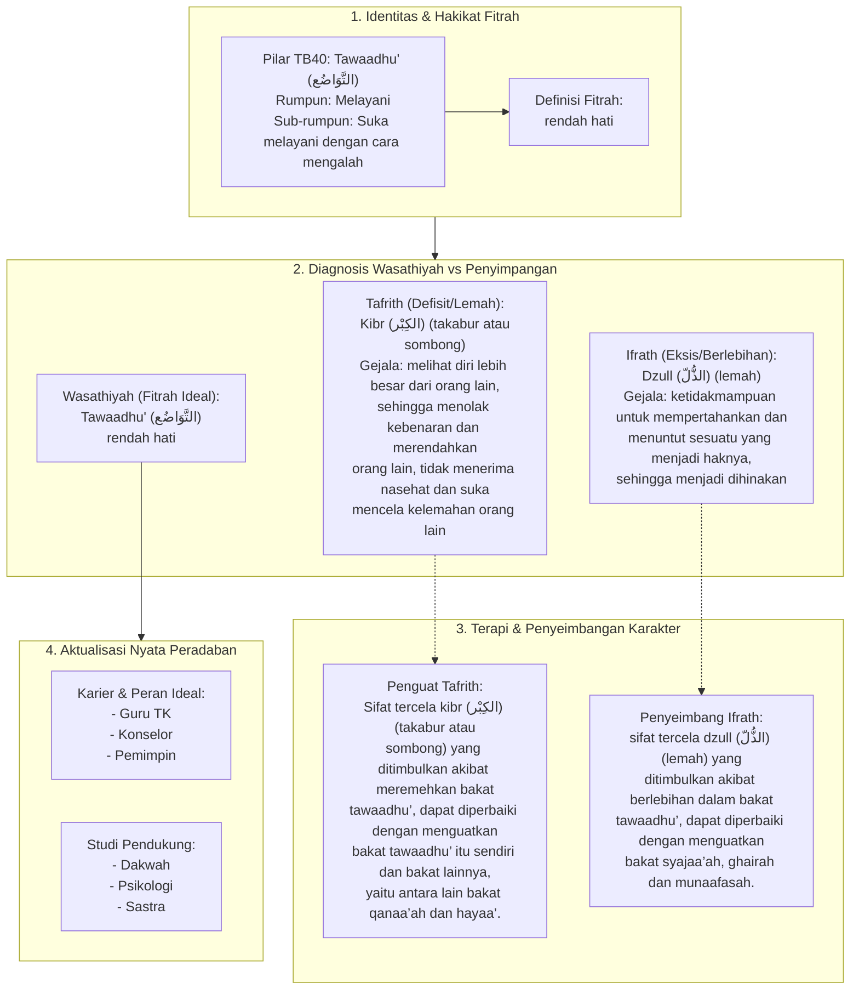

# Alur Materi: Tawaadhu' (التَّوَاضُع) - Rendah Hati

> [!info] Artikel Lengkap
> Berkas materi lengkap: [[content/Paradigma - Implementasi PKN/Dokumen Pendidikan Karakter Nabawiyah/Paradigma & Implementasi/Insan/Fitrah (Karakter)/Bakat/TB40/40-tawaadhu|Tawaadhu' (التَّوَاضُع) - Rendah Hati]]

