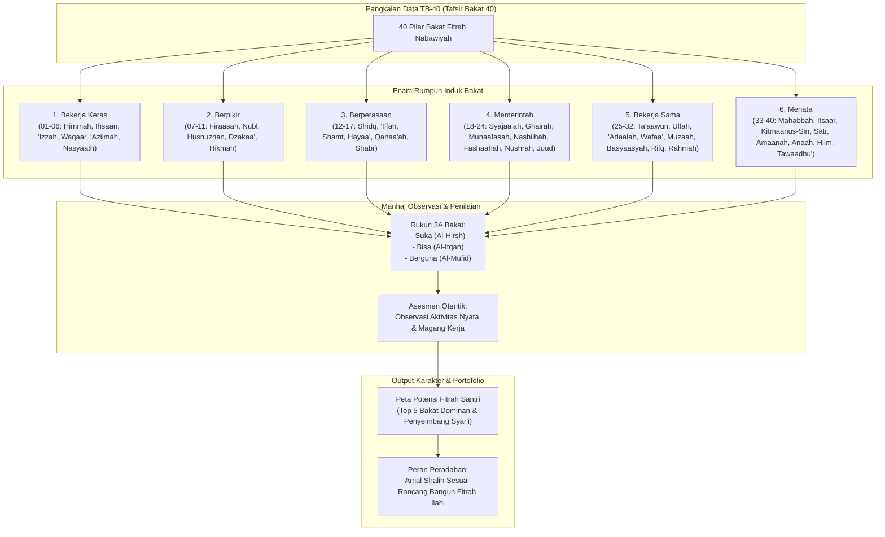

# Alur Materi: Pangkalan Data 40 Pilar Bakat (TB-40)

> [!info] Artikel Lengkap
> Berkas materi lengkap: [[content/Paradigma - Implementasi PKN/Dokumen Pendidikan Karakter Nabawiyah/Paradigma & Implementasi/Insan/Fitrah (Karakter)/Bakat/TB40/index|Pangkalan Data 40 Pilar Bakat (TB-40)]]

