# Alur Materi: Fitrah Keimanan

> [!info] Artikel Lengkap
> Berkas materi lengkap: [[content/Paradigma - Implementasi PKN/Dokumen Pendidikan Karakter Nabawiyah/Paradigma & Implementasi/Insan/Fitrah (Karakter)/Iman/index|Fitrah Keimanan]]

```mermaid
flowchart TD
    subgraph S1["1. Fondasi & Hakikat"]
        N1_1["1. Patologi Pendidikan Agama Kontemporer:<br/>Membalik Kaidah Emas<br/>- Anak menghafal ayat-ayat tentang neraka, namun hatinya<br/>tidak mengenal betapa luasnya rahmat Allah, sehingga ia<br/>tumbuh menjadi pribadi yang cemas, kaku, atau justru<br/>skeptis.<br/>- Al-Qur'an diperlakukan sekadar sebagai objek perlombaan<br/>akademis (musabaqah) demi mengejar piala dan gengsi orang<br/>tua, kehilangan fungsinya sebagai petunjuk hidup (hudan<br/>lin-nas)."]
    end

    subgraph S2["2. Dinamika & Prinsip"]
        N2_1["2. Tahapan Penanaman Fitrah Keimanan Berbasis<br/>Usia"]
        N2_2["3. Teladan Nabawiyah: Menanamkan Fondasi Tauhid<br/>pada Anak-anak<br/>- Wasiat Tauhid kepada Ibnu Abbas: Tatkala membonceng Ibnu<br/>Abbas yang masih belia, Nabi ﷺ tidak mengujinya dengan soal<br/>hafalan yang rumit, melainkan menanamkan intisari tauhid<br/>qadar: “Jika engkau memohon, mohonlah kepada Allah; jika<br/>engkau meminta pertolongan, mintalah kepada Allah...” (HR.<br/>Tirmidzi).<br/>- Kelemahlembutan kepada Anak-anak Badui: Tatkala orang Badui<br/>terheran-heran melihat Nabi ﷺ mencium cucu-cucunya, beliau<br/>bersabda: “Aku tidak bisa berbuat apa-apa jika Allah telah<br/>mencabut rasa kasih sayang dari hatimu!” (HR. Bukhari No.<br/>5998). Cinta orang tua adalah cermin pertama bagi anak untuk<br/>memahami kasih sayang Allah."]
        N2_1 --> N2_2
    end

    subgraph S3["3. Metodologi & Penerapan"]
        N3_1["4. Panduan Aplikatif bagi Ayah dan Bunda<br/>- Jangan Jadikan Allah sebagai &quot;Momok Menakutkan&quot;:<br/>Hindari menakut-nakuti anak yang sedang berbuat salah dengan<br/>kalimat: &quot;Awas ya, nanti kamu dibakar Allah di<br/>neraka!&quot; Kalimat toksik ini merusak citra Allah di<br/>kalbu anak. Gantilah dengan: &quot;Nak, Allah itu Maha Baik,<br/>Allah sayang sekali sama kamu. Kalau kamu berbuat begitu,<br/>Allah sedih. Yuk kita berbuat baik agar Allah semakin<br/>sayang.&quot;<br/>- Hidupkan Budaya Tadabbur Kauniyah di Luar Rumah: Ajak anak<br/>berkemah, mendaki bukit, atau sekadar memandangi langit<br/>malam bertabur bintang. Tanyakan: &quot;Siapa yang<br/>menyalakan bintang-bintang indah itu tanpa tiang penyangga,<br/>Nak?&quot; Biarkan fitrahnya sendiri yang menjawab:<br/>&quot;Allah!&quot;"]
    end

    subgraph S4["4. Evaluasi & Output"]
        N4_1["Diagnosis Penyimpangan: Tafrith vs Ifrath dalam<br/>Fitrah Keimanan"]
        N4_2["Studi Kasus Nyata & Solusi Kuratif Tadarruj<br/>- Skenario Permasalahan<br/>- Tahapan Solusi Kuratif Langkah-demi-Langkah<br/>(Manhaj Tadarruj)"]
        N4_1 --> N4_2
    end

    S1 --> S2
    S2 --> S3
    S3 --> S4
```

