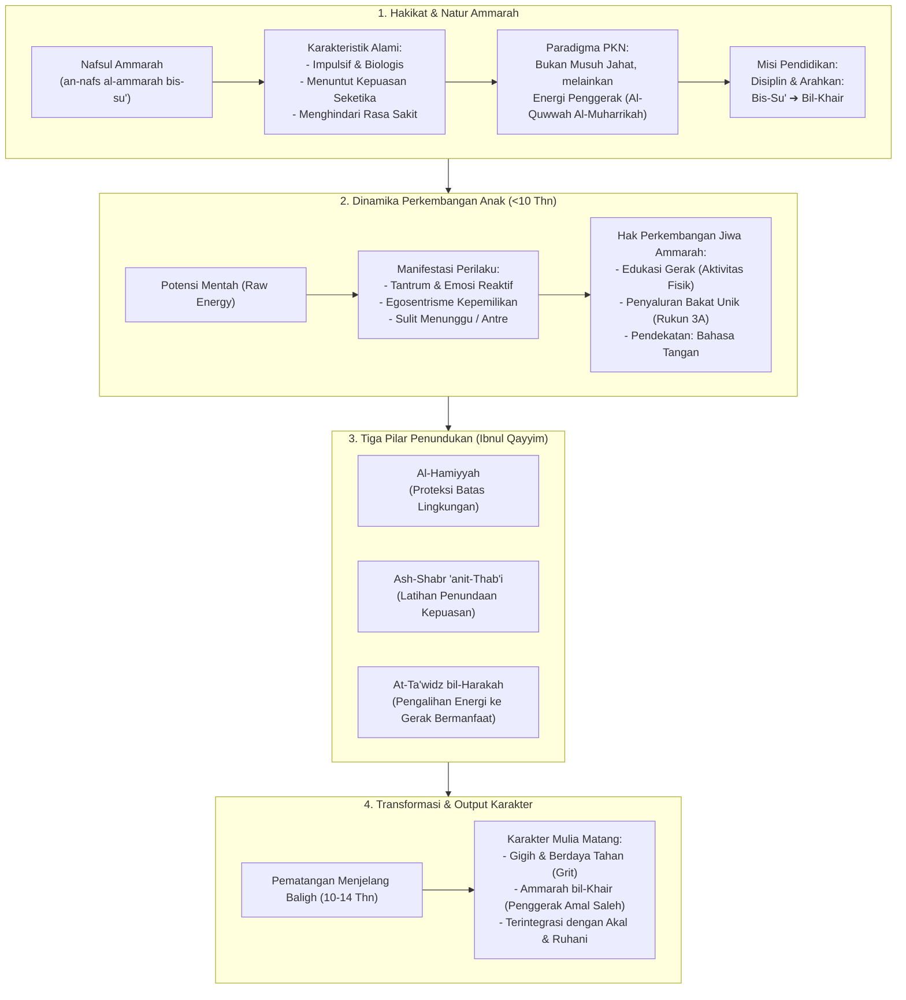

# Alur Materi: Nafsul Ammarah

> [!info] Artikel Lengkap
> Berkas materi lengkap: [[content/Paradigma - Implementasi PKN/Dokumen Pendidikan Karakter Nabawiyah/Paradigma & Implementasi/Insan/Pembagian Jiwa/Ammarah|Nafsul Ammarah]]

