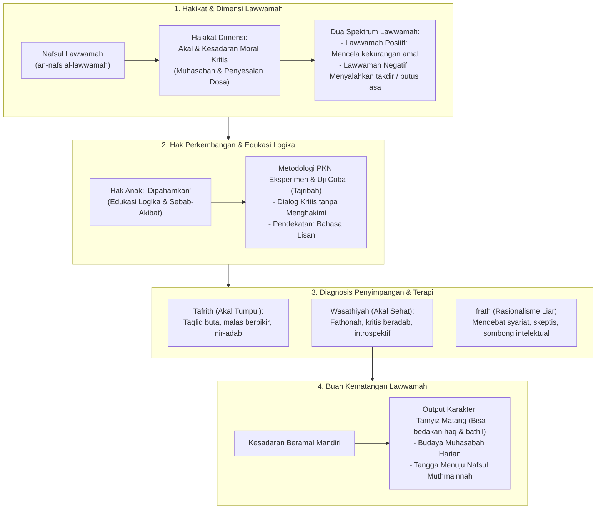

# Alur Materi: Nafsul Lawwamah

> [!info] Artikel Lengkap
> Berkas materi lengkap: [[content/Paradigma - Implementasi PKN/Dokumen Pendidikan Karakter Nabawiyah/Paradigma & Implementasi/Insan/Pembagian Jiwa/Lawwamah|Nafsul Lawwamah]]

