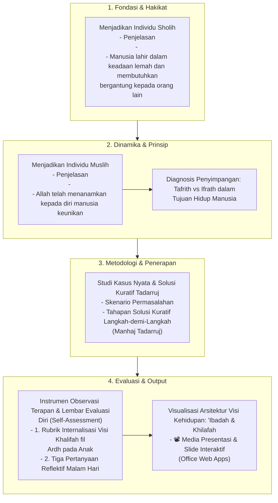

# Alur Materi: Tujuan Hidup Manusia

> [!info] Artikel Lengkap
> Berkas materi lengkap: [[content/Paradigma - Implementasi PKN/Dokumen Pendidikan Karakter Nabawiyah/Paradigma & Implementasi/Insan/Tujuan Hidup Manusia|Tujuan Hidup Manusia]]

