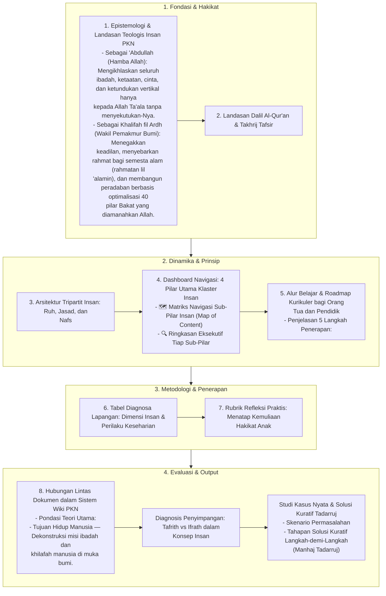

# Alur Materi: Insan

> [!info] Artikel Lengkap
> Berkas materi lengkap: [[content/Paradigma - Implementasi PKN/Dokumen Pendidikan Karakter Nabawiyah/Paradigma & Implementasi/Insan/index|Insan]]

```mermaid
flowchart TD
    subgraph S1["1. Fondasi & Hakikat"]
        N1_1["1. Epistemologi & Landasan Teologis Insan PKN<br/>- Sebagai 'Abdullah (Hamba Allah): Mengikhlaskan seluruh<br/>ibadah, ketaatan, cinta, dan ketundukan vertikal hanya<br/>kepada Allah Ta'ala tanpa menyekutukan-Nya.<br/>- Sebagai Khalifah fil Ardh (Wakil Pemakmur Bumi): Menegakkan<br/>keadilan, menyebarkan rahmat bagi semesta alam (rahmatan lil<br/>'alamin), dan membangun peradaban berbasis optimalisasi 40<br/>pilar Bakat yang diamanahkan Allah."]
        N1_2["2. Landasan Dalil Al-Qur'an & Takhrij Tafsir"]
        N1_1 --> N1_2
    end

    subgraph S2["2. Dinamika & Prinsip"]
        N2_1["3. Arsitektur Tripartit Insan: Ruh, Jasad, dan<br/>Nafs"]
        N2_2["4. Dashboard Navigasi: 4 Pilar Utama Klaster<br/>Insan<br/>- 🗺️ Matriks Navigasi Sub-Pilar Insan (Map of<br/>Content)<br/>- 🔍 Ringkasan Eksekutif Tiap Sub-Pilar"]
        N2_1 --> N2_2
        N2_3["5. Alur Belajar & Roadmap Kurikuler bagi Orang<br/>Tua dan Pendidik<br/>- Penjelasan 5 Langkah Penerapan:"]
        N2_2 --> N2_3
    end

    subgraph S3["3. Metodologi & Penerapan"]
        N3_1["6. Tabel Diagnosa Lapangan: Dimensi Insan &<br/>Perilaku Keseharian"]
        N3_2["7. Rubrik Refleksi Praktis: Menatap Kemuliaan<br/>Hakikat Anak"]
        N3_1 --> N3_2
    end

    subgraph S4["4. Evaluasi & Output"]
        N4_1["8. Hubungan Lintas Dokumen dalam Sistem Wiki PKN<br/>- Pondasi Teori Utama:<br/>- Tujuan Hidup Manusia — Dekonstruksi misi ibadah dan<br/>khilafah manusia di muka bumi."]
        N4_2["Diagnosis Penyimpangan: Tafrith vs Ifrath dalam<br/>Konsep Insan"]
        N4_1 --> N4_2
        N4_3["Studi Kasus Nyata & Solusi Kuratif Tadarruj<br/>- Skenario Permasalahan<br/>- Tahapan Solusi Kuratif Langkah-demi-Langkah<br/>(Manhaj Tadarruj)"]
        N4_2 --> N4_3
    end

    S1 --> S2
    S2 --> S3
    S3 --> S4
```
