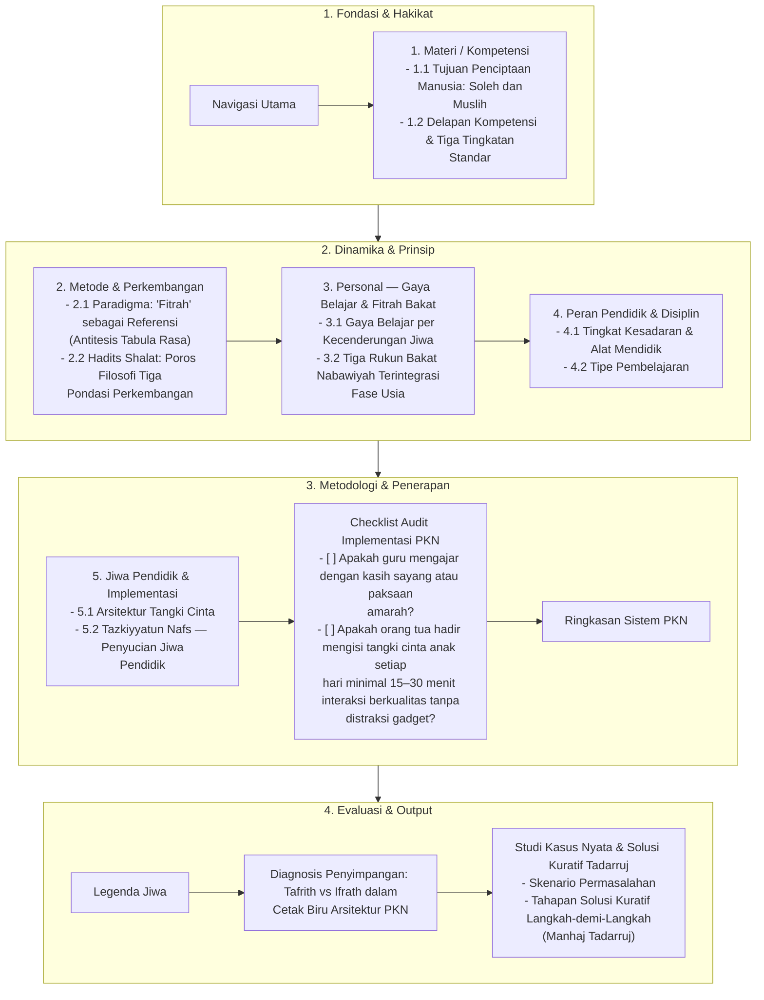

# Alur Materi: PKN Blueprint: Arsitektur Sistem Pendidikan Karakter Nabawiyah

> [!info] Artikel Lengkap
> Berkas materi lengkap: [[content/Paradigma - Implementasi PKN/Dokumen Pendidikan Karakter Nabawiyah/Paradigma & Implementasi/PKN Blueprint Arsitektur Sistem|PKN Blueprint: Arsitektur Sistem Pendidikan Karakter Nabawiyah]]

