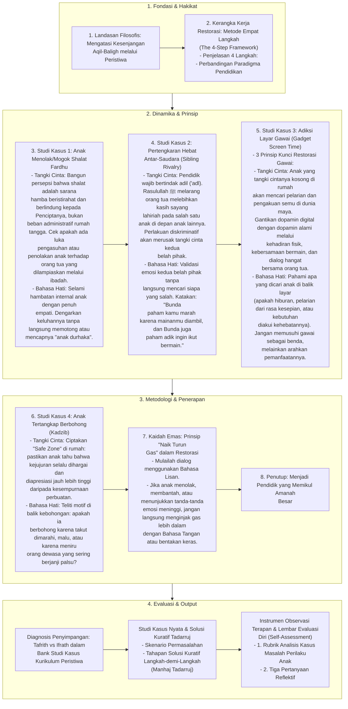

# Alur Materi: Bank Studi Kasus

> [!info] Artikel Lengkap
> Berkas materi lengkap: [[content/Paradigma - Implementasi PKN/Dokumen Pendidikan Karakter Nabawiyah/Paradigma & Implementasi/Pendidikan Ideal/Bank Studi Kasus|Bank Studi Kasus]]

