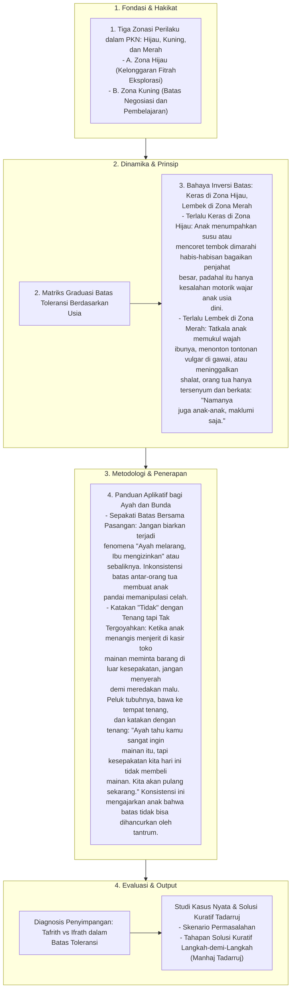

# Alur Materi: Batas Toleransi

> [!info] Artikel Lengkap
> Berkas materi lengkap: [[content/Paradigma - Implementasi PKN/Dokumen Pendidikan Karakter Nabawiyah/Paradigma & Implementasi/Pendidikan Ideal/Batas Toleransi|Batas Toleransi]]

