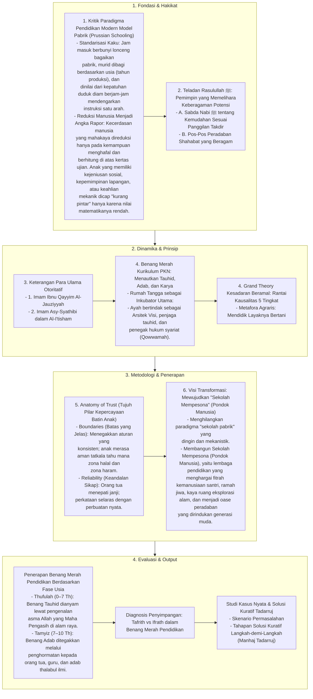

# Alur Materi: Benang Merah Pendidikan

> [!info] Artikel Lengkap
> Berkas materi lengkap: [[content/Paradigma - Implementasi PKN/Dokumen Pendidikan Karakter Nabawiyah/Paradigma & Implementasi/Pendidikan Ideal/Benang Merah Pendidikan|Benang Merah Pendidikan]]

