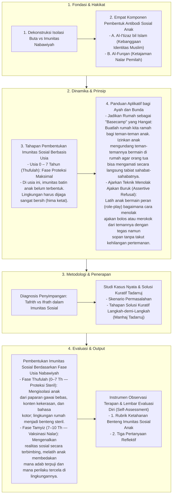

# Alur Materi: Imunitas Sosial

> [!info] Artikel Lengkap
> Berkas materi lengkap: [[content/Paradigma - Implementasi PKN/Dokumen Pendidikan Karakter Nabawiyah/Paradigma & Implementasi/Pendidikan Ideal/Imunitas Sosial|Imunitas Sosial]]

