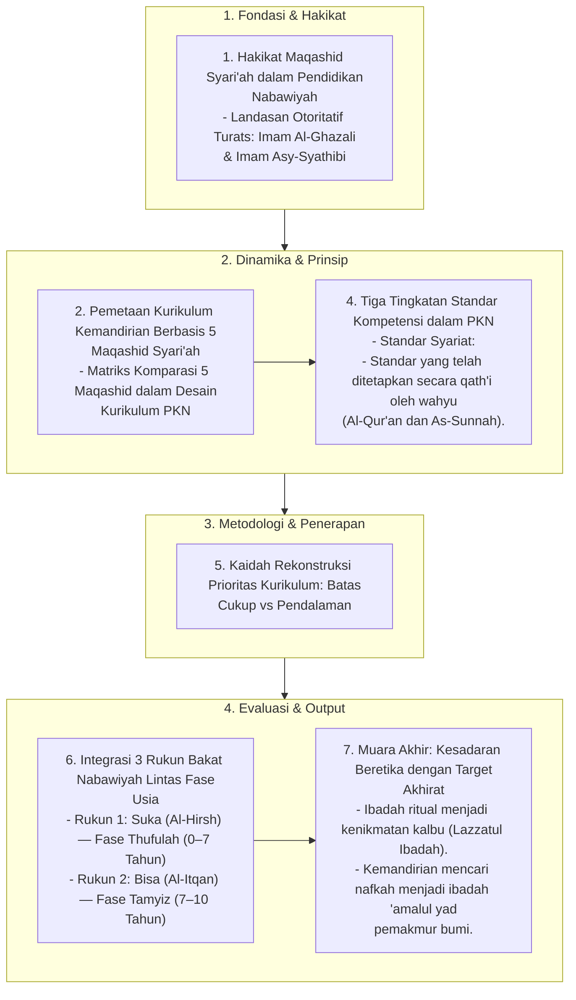

# Alur Materi: Kurikulum Kemandirian Berbasis Maqashid Syari'ah

> [!info] Artikel Lengkap
> Berkas materi lengkap: [[content/Paradigma - Implementasi PKN/Dokumen Pendidikan Karakter Nabawiyah/Paradigma & Implementasi/Pendidikan Ideal/Kurikulum Kemandirian Berbasis Maqashid Syariah|Kurikulum Kemandirian Berbasis Maqashid Syari'ah]]

