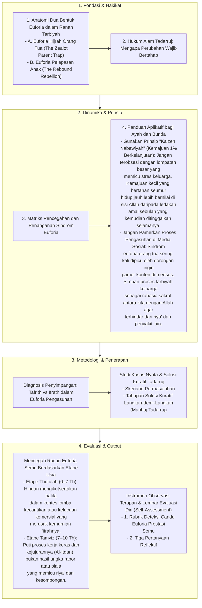

# Alur Materi: Fase Euforia

> [!info] Artikel Lengkap
> Berkas materi lengkap: [[content/Paradigma - Implementasi PKN/Dokumen Pendidikan Karakter Nabawiyah/Paradigma & Implementasi/Pendidikan Ideal/Luka dan Hutang Pengasuhan/Euforia|Fase Euforia]]

