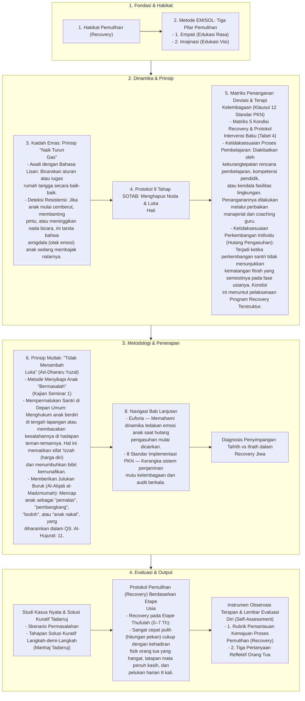

# Alur Materi: Recovery

> [!info] Artikel Lengkap
> Berkas materi lengkap: [[content/Paradigma - Implementasi PKN/Dokumen Pendidikan Karakter Nabawiyah/Paradigma & Implementasi/Pendidikan Ideal/Luka dan Hutang Pengasuhan/Recovery|Recovery]]

